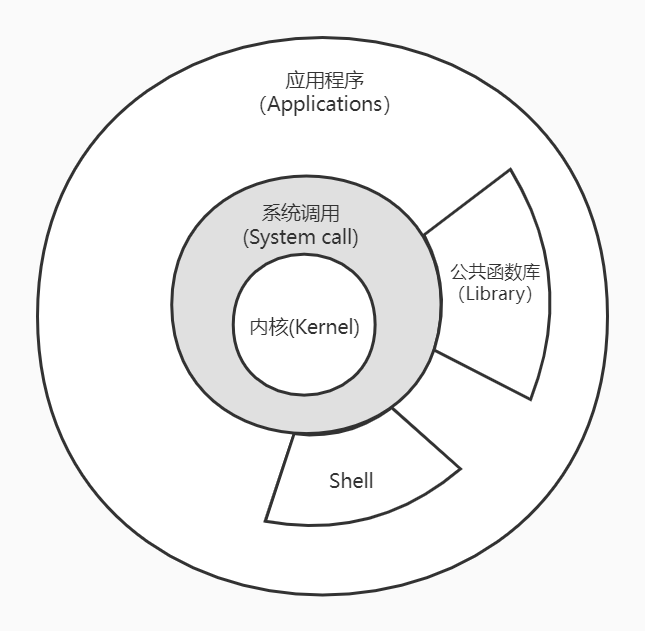

# UNIX环境高级编程

书籍《UNIX环境高级编程》（aka APUE）的笔记，组织结构完全和书上一致，仅记录重点、关键点和思维骨架，帮助串联回忆，不记录过多细节，细节需要看书来补充。

## 0. 准备

UNIX发行版：
- FreeBSD
- Linux (Unix-like)
- Apple Mac OS X (Darwin)
- Solaris

选择环境：
- WSL2 Ubuntu 20.04 LTS，配合VSCode。
- 实体机或虚拟机亦可，其他发行版亦可。

源码：
- 访问[http://www.apuebook.com/code3e.html](http://www.apuebook.com/code3e.html)下载第三版APUE的源码。
- 所有代码都是ANSI C标准编写，可以运行于所有Unix系统上，一般来说最常见的还是Linux和MacOS。
- 代码结构是一章一个目录，基本上每个例子一个小文件，会共用一个公共的头文件`apue.h`。
- 编译过程中会遇到错误，使用`-i`选项忽略错误继续编译：
```bash
make -i
```
- 本地编译过程中会遇到两个文件编译错误：`./filedir/devrdev.c`和`./stdio/buf.c`，无伤大雅，都是单独的例子，不影响其他代码，等用到了再解决就行。
- 然后需要运行书中给了源码的例子时直接去对应目录下找到程序运行或者找到源码调试就行啦。
- 为了方便，代码上传到了[APUE分支](../../tree/APUE/)，版权归原作者所有，未做任何修改。

Unix程序员手册:
- UNIX Programmer's Manual
- 操作系统内置，使用`man`命令查看，划分为了多个部分：
```
       man  is  the system's manual pager.  Each page argument given to man is normally the name of a program, utility or function.  The manual page associated with each of these arguments is then found and displayed.  A section, if provided, will direct man to look only in that section
       of the manual.  The default action is to search in all of the available sections following a pre-defined order (see DEFAULTS), and to show only the first page found, even if page exists in several sections.

       The table below shows the section numbers of the manual followed by the types of pages they contain.

       1   Executable programs or shell commands
       2   System calls (functions provided by the kernel)
       3   Library calls (functions within program libraries)
       4   Special files (usually found in /dev)
       5   File formats and conventions, e.g. /etc/passwd
       6   Games
       7   Miscellaneous (including macro packages and conventions), e.g. man(7), groff(7)
       8   System administration commands (usually only for root)
       9   Kernel routines [Non standard]
```
- 可以查看命令、系统调用、库函数等。例子`man ls`，`man 2 open`。

## 1. UNIX基础知识

### 1.1 体系结构



说明：
- 内核提供的接口称为系统调用，公共函数库和Shell构建在系统调用之上。
- 应用程序既可以使用系统调用也可以使用公共函数库，Shell是一个特殊的程序，为运行其他应用程序提供接口/环境。
- Linux是内核，GNU/Linux是操作系统。

### 1.2 登录

登录名：位于口令文件`/etc/passwd`，`:`分隔的7个字段，登录名、加密口令、用户ID、用户组ID、注释、起始目录、Shell程序。
```
root:x:0:0:root:/root:/bin/bash
```
Shell：shell是一个命令行解释器，读取用户输入，执行命令。用户输入通常来自于终端键入或者文件（Shell脚本）。系统从口令文件最后一个字段了解到要执行哪一个shell。常见的Shell：
- `/bin/sh` Bourne shell
- `/bin/bash` Bourne-aggin shell
- `/bin/csh` C shell
- `/bin/ksh` Korn shell
- `/bin/tcsh` TENEX C shell
- 功能各有不同，Linux默认常用`bash`，所有Unix都提供`sh`，后续的实例都会使用所有shell通用的功能。

### 1.3 文件与目录

文件系统：
- 根（Root）目录：`/`
- 目录是包含目录项的文件，每个文件除了文件名还包含文件属性信息：文件类型（目录或文件）、文件大小、所有者、权限、最后修改时间等信息。
- 目录项的逻辑视图与其存储在磁盘上的逻辑视图不同。

文件名：
- `/`和空字符不能出现在文件名中。
- `/`用来分隔构成路径的目录，空字符用来终止一个路径（C风格字符串）。
- 习惯上只使用常用印刷字符的子集作为文件名。POSIX.1推荐字符集合：`a~zA~Z0~9.-_`。
- 创建新目录时自动创建`.`指向当前目录和`..`指向父目录，`/`中`..`与`.`相同。

路径：
- 绝对路径：`/`开头。
- 相对路径：不以`/`开头，相对于当前工作目录。

工作目录：
- 每个进程都有一个工作目录（working directory），也成当前工作目录（cwd，current working directory）。
- 所有相对路径都相对于工作目录开始解释。
- 进程可以使用`chdir`函数更改其工作目录。

起始目录：
- 登录时，工作目录设置为起始目录/家目录（home directory），从口令文件中获得。

## 1.4 输入输出

文件描述符：
- file descriptor， 通常是一个小的非负整数，内核以此来标识一个特定进程正在打开的文件。
- 当内核创建一个新文件或者打开一个现有文件时创建都会返回一个文件描述符，读写文件时使用。

标准输入、标准输出、标准错误：
- 运行一个新程序时，所有shell都为其打开3个文件描述符。标准输入（standard input），标准输出（standard output），标准错误（standard error），他们的文件描述符分别是0、1、2，于头文件`<unistd.h>`中定义。
- 不做特殊处理的话他们都链接到终端。
- 可以对其中的一个或多个重定向到某个文件。如：
```bash
ls > list.txt 2> err.txt
```
- 使用`> >> 2> 2>> 2>&1`等用来以覆盖和叠加方式重定向输出，或者将错误重定向到标准输出之类，`< <<`输入重定向。
- 标准输入时，Ctrl+D键入文件结束符（EOF）。

不带缓冲的IO：
- 函数`open read write lseek close`提供，他们使用文件描述符。
- 需要自己要读取或者要读取到的内存，
- 例子：[`intro/mycat.c`](../../tree/APUE/intro/mycat.c)

标准IO：
- 标准IO函数为那些不带缓冲的函数提供一个带缓冲的接口，无需担心如何选取缓冲区大小。
- `putc fgets printf`等函数，头文件`<stdio.h>`，标准IO常量`stdin stdout stderr`（`FILE *`类型），`EOF`常量（值为-1）。
- 例子：[`intro/getcputc.c`](../../tree/APUE/intro/getcputc.c)

## 1.5 程序和进程

程序：
- 程序（program）是一个存储在磁盘上的可执行文件。
- 内核使用`exec`将程序读取内存，并执行。

进程：
- 程序的执行实例叫做进程（Process），某些操作系统也称其为任务（task）。
- UNIX系统确保每个进程都有一个唯一的数字标识符，称为进程ID（process ID），用`getpid()`获取，总是一个非负整数。
- 例子：[`intro/hello.c`](../../tree/APUE/intro/hello.c)

进程控制：
- 3个用于进程控制的主要函数：`fork exec waitpid`，`exec`有7中变体，统称`exec`函数。