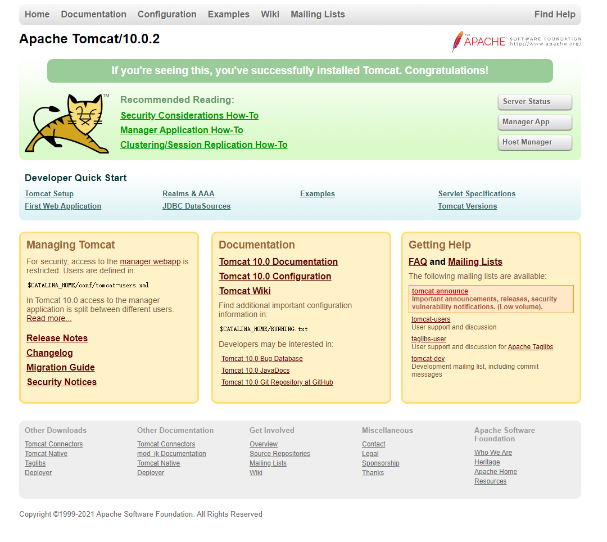

<!-- START doctoc generated TOC please keep comment here to allow auto update -->
<!-- DON'T EDIT THIS SECTION, INSTEAD RE-RUN doctoc TO UPDATE -->
**目录**  *generated with [DocToc](https://github.com/thlorenz/doctoc)*

- [Nginx](#nginx)
  - [0. Nginx简介](#0-nginx%E7%AE%80%E4%BB%8B)
    - [0.1 什么是Nginx](#01-%E4%BB%80%E4%B9%88%E6%98%AFnginx)
    - [0.2 Nginx基本特性](#02-nginx%E5%9F%BA%E6%9C%AC%E7%89%B9%E6%80%A7)
    - [0.3 Nginx相关资料](#03-nginx%E7%9B%B8%E5%85%B3%E8%B5%84%E6%96%99)
  - [1. Mginx概念](#1-mginx%E6%A6%82%E5%BF%B5)
    - [1.1 反向代理](#11-%E5%8F%8D%E5%90%91%E4%BB%A3%E7%90%86)
    - [1.2 负载均衡](#12-%E8%B4%9F%E8%BD%BD%E5%9D%87%E8%A1%A1)
    - [1.3 动静分离](#13-%E5%8A%A8%E9%9D%99%E5%88%86%E7%A6%BB)
  - [2. Nginx使用](#2-nginx%E4%BD%BF%E7%94%A8)
    - [2.1 安装Nginx](#21-%E5%AE%89%E8%A3%85nginx)
    - [2.2 常用命令](#22-%E5%B8%B8%E7%94%A8%E5%91%BD%E4%BB%A4)
    - [2.3 配置文件](#23-%E9%85%8D%E7%BD%AE%E6%96%87%E4%BB%B6)
  - [3. Nginx配置实例](#3-nginx%E9%85%8D%E7%BD%AE%E5%AE%9E%E4%BE%8B)
    - [3.1 反向代理实例](#31-%E5%8F%8D%E5%90%91%E4%BB%A3%E7%90%86%E5%AE%9E%E4%BE%8B)
    - [3.2 负载均衡实例](#32-%E8%B4%9F%E8%BD%BD%E5%9D%87%E8%A1%A1%E5%AE%9E%E4%BE%8B)
    - [3.3 动静分离实例](#33-%E5%8A%A8%E9%9D%99%E5%88%86%E7%A6%BB%E5%AE%9E%E4%BE%8B)
    - [3.4 Nginx配置高可用集群](#34-nginx%E9%85%8D%E7%BD%AE%E9%AB%98%E5%8F%AF%E7%94%A8%E9%9B%86%E7%BE%A4)
  - [4. Nginx原理](#4-nginx%E5%8E%9F%E7%90%86)
  - [5. 参考资料](#5-%E5%8F%82%E8%80%83%E8%B5%84%E6%96%99)
  - [TODO](#todo)

<!-- END doctoc generated TOC please keep comment here to allow auto update -->

# Nginx


## 0. Nginx简介

### 0.1 什么是Nginx

发音：engine X

简介：
- Nginx是一款轻量级的Web服务器、反向代理服务器及电子邮件（IMAP/POP3）代理服务器，在BSD-like 协议下发行。
- 其特点是占有内存少，并发能力强，高性能。
- 专为性能而开发，性能是其最重要的考量，实现上非常注重效率。

### 0.2 Nginx基本特性

- 处理静态文件，索引文件以及自动索引。
- 反向代理加速(无缓存)，简单的负载均衡和容错。
- FastCGI，简单的负载均衡和容错。
- 模块化的结构。过滤器包括gzipping, byte ranges, chunked responses, 以及 SSI-filter 。在SSI过- 滤器中，到同一个 proxy 或者 FastCGI 的多个子请求并发处理。
- SSL 和 TLS SNI 支持。


### 0.3 Nginx相关资料

- [官网](https://www.nginx.com/)
- [源码Github镜像](https://github.com/nginx/nginx)
- [Nginx中文文档](https://www.nginx.cn/doc/)
- [菜鸟教程Nginx安装配置](https://www.runoob.com/linux/nginx-install-setup.html)


## 1. Mginx概念

### 1.1 反向代理

Nginx 不仅可以做反向代理，实现负载均衡。还能用作正向代理来进行上网等功能。
**正向代理**：如果把局域网外的 Internet 想象成一个巨大的资源库，则局域网中的客户端要访问 Internet，则需要通过代理服务器来访问，这种代理服务就称为正向代理。**在客户端中都需要配置代理服务器。**

**反向代理**：反向代理，其实客户端对代理是无感知的，因为**客户端不需要任何配置就可以访问**，我们只需要将请求发送到反向代理服务器，由反向代理服务器去选择目标服务器获取数据后，在返回给客户端，此时反向代理服务器和目标服务器对外就是一个服务器，暴露的是代理服务器地址，隐藏了真实服务器 IP 地址。

现在有了一个大概的概念，但完全不清楚细节。

### 1.2 负载均衡

客户端发送多个请求到服务器，服务器处理请求，有一些可能要与数据库进行交互，服务器处理完毕后，再将结果返回给客户端。

这种架构模式对于早期的系统相对单一，并发请求相对较少的情况下是比较适合的，成本也低。但是随着信息数量的不断增长，访问量和数据量的飞速增长，以及系统业务的复杂度增加，这种架构会造成服务器相应客户端的请求日益缓慢，并发量特别大的时候，还容易造成服务器直接崩溃。

由于单台服务器配置提升是有上限的，而且成本高，所以就需要横向增加服务器的数量。这时候集群的概念产生了，单个服务器解决不了，增加服务器的数量，然后将请求分发到各个服务器上，将原先请求集中到单个服务器上的情况改为由**反向代理服务器**（NginX就是充当的这个角色）将请求分发到多个服务器上，将负载分发到不同的服务器，这就是**负载均衡**。

### 1.3 动静分离

为了加快网站的解析速度，可以把动态页面和静态页面由不同的服务器来解析，加快解析速度。降低原来单个服务器的压力。

Tomcat服务器资源：
- 静态资源：html/css/js
- 动态资源：jsp/servelet

将其分开部署到不同的Tomcat服务器就叫做动静分离。

## 2. Nginx使用

### 2.1 安装Nginx

- [官网下载地址](http://nginx.org/)
- Ubuntu: `apt install nginx`
- CentOS: `yum install nginx`

我的环境：Ubuntu18.04 Server，什么环境不重要，也可以在本地的WSL或者虚拟机上安装
- 查看软件安装路径：`whereis nginx`
- 查看运行文件路径：`which nginx`, 路径是`usr/sbin/nginx`
- 配置文件路径：`/etc/nginx/`
- 启动: `nginx`
- 防火墙：CentOS中是`Firewalld`，Ubuntu中默认是`ufw`
- `ufw staus`查看防火墙状态，如果端口未开放，可以添加使其开放。或者直接把防火墙关了也行，防火墙相关内容不在这里详述。

### 2.2 常用命令

- 启动：`nginx`
- 版本：`nginx -v`
- 关闭：`nginx -s stop`
- 安全退出: `nginx -s quit`
- 重新加载配置文件：`nginx -s reload`
- 检查配置文件语法：`nginx -t`
- 执行`nginx`启动后就可以在主机地址上看到Nginx默认页面了。
- `ps -aux | grep nginx`查看nginx进程

### 2.3 配置文件

- 主配置文件：`/etc/nginx/nginx.conf`
- 一个配置文件内容：
```conf
user root;
worker_processes auto;
pid /run/nginx.pid;
include /etc/nginx/modules-enabled/*.conf;

events {
    worker_connections 768;
    # multi_accept on;
}

http {
    server {
        keepalive_requests 120;
        listen 80;
        server_name 127.0.0.1;
        location / {
            root /var/www/blog;
            index index.html;
        }
    }

    ##
    # Basic Settings
    ##

    sendfile on;
    tcp_nopush on;
    tcp_nodelay on;
    keepalive_timeout 65;
    types_hash_max_size 2048;
    # server_tokens off;

    # server_names_hash_bucket_size 64;
    # server_name_in_redirect off;

    include /etc/nginx/mime.types;
    default_type application/octet-stream;

    ##
    # SSL Settings
    ##

    ssl_protocols TLSv1 TLSv1.1 TLSv1.2; # Dropping SSLv3, ref: POODLE
    ssl_prefer_server_ciphers on;

    ##
    # Logging Settings
    ##

    access_log /var/log/nginx/access.log;
    error_log /var/log/nginx/error.log;

    ##
    # Gzip Settings
    ##

    gzip on;

    # gzip_vary on;
    # gzip_proxied any;
    # gzip_comp_level 6;
    # gzip_buffers 16 8k;
    # gzip_http_version 1.1;
    # gzip_types text/plain text/css application/json application/javascript text/xml application/xml application/xml+rss text/javascript;

    ##
    # Virtual Host Configs
    ##

    include /etc/nginx/conf.d/*.conf;
    include /etc/nginx/sites-enabled/*;
    
    
}


#mail {
#   # See sample authentication script at:
#   # http://wiki.nginx.org/ImapAuthenticateWithApachePhpScript
#   
#   # auth_http localhost/auth.php;
#   # pop3_capabilities "TOP" "USER";
#   # imap_capabilities "IMAP4rev1" "UIDPLUS";
#   
#   server {
#       listen     80;
#       protocol   pop3;
#       proxy      on;
#   }
#   
#   server {
#       listen     localhost:143;
#       protocol   imap;
#       proxy      on;
#   }
#}
```

其中分为三个块：
- 全局块：影响服务器整体运行的配置指令。
    ```conf
    user www-data;          # 用户
    worker_processes auto;  # 允许生成的进程数
    pid /run/nginx.pid;     # 进程pid存放路径
    include /etc/nginx/modules-enabled/*.conf;
    ```
- `events`块： Nginx 服务器与用户的网络连接，常用的设置包括是否开启对多 worker process 下的网络连接进行序列化，是否允许同时接收多个网络连接，选取哪种事件驱动模型来处理连接请求，每个 worker process 可以同时支持的最大连接数等。
    ```conf
    worker_connections 768; # 支持最大连接数
    ```
- `http`块：Nginx服务器配置中最频繁的部分，代理、缓存和日志定义等绝大多数功能和第三方模块的配置都在这里。`http`块也可以包括 `http`全局块、`server`块。
    - `http`全局块配置的指令包括文件引入、`MIME-TYPE` 定义、日志自定义、连接超时时间、单链接请求数上限等。
    - `server`块：这块和虚拟主机有密切关系，虚拟主机从用户角度看，和一台独立的硬件主机是完全一样的，该技术的产生是为了节省互联网服务器硬件成本。
    - 每个`http`块可以包括多个`server`块，而每个`server`块就相当于一个虚拟主机。
    - 而每个`server`块也分为全局`server`块，以及可以同时包含多个`location`块。
        - 全局`server`块：最常见的配置是本虚拟机主机的监听配置和本虚拟主机的名称或IP配置。
        - `location`块：一个`server`块可以配置多个`location`块。这块的主要作用是基于 Nginx 服务器接收到的请求字符串（例如 `server_name/uri-string`），对虚拟主机名称（也可以是 IP 别名）之外的字符串（例如 前面的 `/uri-string`）进行匹配，对特定的请求进行处理。地址定向、数据缓存和应答控制等功能，还有许多第三方模块的配置也在这里进行。

## 3. Nginx配置实例

### 3.1 反向代理实例

**实现效果**：浏览器地址栏输入`www.123.com`，跳转到linux系统tomcat主页面。

**装备工作**：
1. Linux中安装tomcat，使用默认端口8080。
    - [官网下载](https://tomcat.apache.org/)，有好几个版本，不同的版本好像对应不同的Servlet/JSP/WebSocket版本。姑且先装一个10.0.x吧，当然也不一定越新越好，这里测试用啥版本都行。本地下载后传输到Linux服务器比较方便，使用`rz`（服务器received）命令上传，`sz`（服务器send）下载文件到本地，使用`apt install lrzsz`安装。如果在WSL里面的话，是可以直接在`/mnt`找到挂载的硬盘的，直接`cp`过去即可。VMware虚拟机的话安装了VMTools，直接拖进去就行。
    - 得到`apache-tomcat-10.0.2.tar.gz`之后，放到`/opt`，解压`tar -xvf [file]`。
    - 进入解压后的`bin/`目录，执行`./startup.sh`启动tomcat。
    - 未安装JDk的话需要安装JDK才能成功执行。（TODO: Java相关的东西不了解，先挖坑，以后填了记得更新这里。）这里装`apt install openjdk11-jre-headless`，只要tomcat支持这个版本就行，都是向后支持，安装最新的JDK则一定是支持的（这里服务器包管理上最新只有这个，应该不算最新的版本）。执行`java -version`查看版本。 
    - 然后回到tomcat的`bin`目录执行`./startup.sh`启动tomcat，就可以在`yourhost:8080`上看到tomcat页面了，端口是必不可少的。
    
2. 检查8080端口是否开放，防火墙相关，如果禁用了需要开放8080端口，不赘述，但要有这个意识。
3. 修改Host文件(管理员权限打开`C:\Windows\System32\drivers\etc\hosts`)添加`your_host_ip www.123.com`项。无论是局域网IP还是公网IP都是可行的。

**Nginx配置反向代理**：
- 编辑配置文件`/etc/nginx/nginx.conf`。
- `http`域中的`server`域添加或修改：
```conf
server { # 将发送给Nginx服务器192.168.35.1:80的请求转发到127.0.0.1:8080
    listen 80;
    server_name 192.168.35.1; # 主机IP
    location \ {
        # root html;
        proxy_pass http://127.0.0.1:8080; # 转发到8080端口
        index index.html index.htm;
    }
}
```
- `nginx`启动Nginx，浏览器输入`www.123.com`即可访问。
- 网页的数据一般放在：`/var/www/`。

**访问过程分析**：
- 三个部分：客户端（浏览器），代理服务器（Nginx），Web服务器（tomcat）。
- 套接字：Nginx（`you_host_ip:80`），tomcat（`127.0.0.1:8080`）。
- 浏览器不能直接访问到tomcat，而是通过Nginx反向代理来访问到tomcat。Nginx负责转发请求到tomcat。
- 需要修改本地host文件，将`www.123.com`指向你的主机IP，也就是说本地host文件优先于DNS解析。实际建立网站的话有了服务器之后还需要购买域名，解析到对应的IP即可。

### 3.2 负载均衡实例

### 3.3 动静分离实例

### 3.4 Nginx配置高可用集群

## 4. Nginx原理

## 5. 参考资料

- [Bilibili-尚硅谷Nginx教程](https://www.bilibili.com/video/BV1zJ411w7SV?from=search&seid=6880208276596727856)(本文主要参考)
- [Nginx中文文档](https://www.nginx.cn/doc/)

## TODO

- 相关内容了解学习：Java，tomcat，Web服务器
- Nginx深入，如阅读源码
