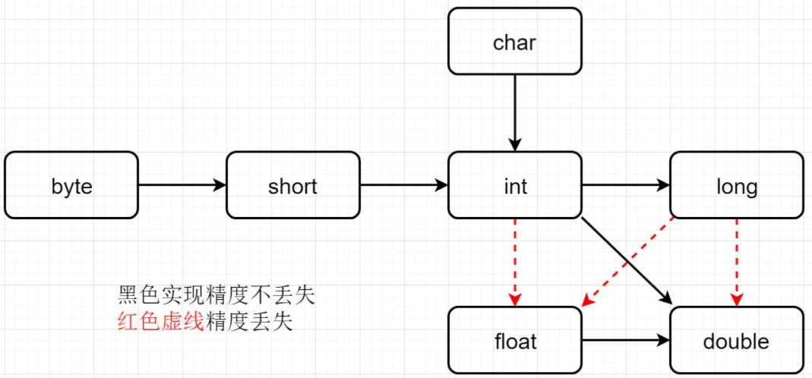

<!-- START doctoc generated TOC please keep comment here to allow auto update -->
<!-- DON'T EDIT THIS SECTION, INSTEAD RE-RUN doctoc TO UPDATE -->
**Table of Contents**  *generated with [DocToc](https://github.com/thlorenz/doctoc)*

- [Scala语言入门](#scala%E8%AF%AD%E8%A8%80%E5%85%A5%E9%97%A8)
  - [环境配置](#%E7%8E%AF%E5%A2%83%E9%85%8D%E7%BD%AE)
  - [IDEA环境配置](#idea%E7%8E%AF%E5%A2%83%E9%85%8D%E7%BD%AE)
  - [变量与数据类型](#%E5%8F%98%E9%87%8F%E4%B8%8E%E6%95%B0%E6%8D%AE%E7%B1%BB%E5%9E%8B)
  - [运算符、控制流](#%E8%BF%90%E7%AE%97%E7%AC%A6%E6%8E%A7%E5%88%B6%E6%B5%81)
  - [函数式编程](#%E5%87%BD%E6%95%B0%E5%BC%8F%E7%BC%96%E7%A8%8B)
  - [面向对象](#%E9%9D%A2%E5%90%91%E5%AF%B9%E8%B1%A1)
  - [集合](#%E9%9B%86%E5%90%88)
  - [模式匹配](#%E6%A8%A1%E5%BC%8F%E5%8C%B9%E9%85%8D)
  - [异常处理](#%E5%BC%82%E5%B8%B8%E5%A4%84%E7%90%86)
  - [隐式转换](#%E9%9A%90%E5%BC%8F%E8%BD%AC%E6%8D%A2)
  - [泛型](#%E6%B3%9B%E5%9E%8B)

<!-- END doctoc generated TOC please keep comment here to allow auto update -->

# Scala语言入门

Scala（发音为/ˈskɑːlə, ˈskeɪlə/）是一门多范式的编程语言，设计初衷是要集成面向对象编程和函数式编程的各种特性。洛桑联邦理工学院的Martin Odersky于2001年基于Funnel的工作开始设计Scala。Java平台的Scala于2003年底/2004年初发布。

特点：
- 同样运行在JVM上，可以与现存程序同时运行。
- 可直接使用Java类库。
- 同Java一样静态类型。
- 语法和Java类似，比Java更加简洁(注意简洁不代表简单，会更复杂一点)，表达性更强。
- 同时支持面向对象、函数式编程。
- 比Java更面向对象。

关注点：
- 类型推断、不变量、函数式编程、高级程序构造。
- 并发：actor模型。
- 和现有Java代码交互、相比Java异同和优缺。

和Java关系：
```
        javac               java
.java --------> .class ----------> run on JVM
.scala -------> .class ----------> run on JVM
        scalac              scala
```

阅读：
- [尚硅谷大数据技术之Scala入门到精通教程](https://www.bilibili.com/video/BV1Xh411S7bP)

## 环境配置

Scala需要依赖Java，访问[这里](https://docs.scala-lang.org/overviews/jdk-compatibility/overview.html)查看特定Scala版本依赖的Java版本。这里选择，最新的JDK17配合Scala2.13.6。

Windows中下载安装配置环境变量：
- 类似于java配置`SCALA_HOME`为安装目录。
- 添加`%SCALA_HOME%\bin`到path环境变量。

Linux中类似，可以使用包管理器，但如果依赖版本不严格一致的话，需要官网下载对应版本安装即可。

也有交互式执行环境：
```
scala
```

交互式执行环境中的传统艺能：
```scala
println("hello,world!")
```

暂时不管项目配置，还是单文件编译执行为主，项目开发肯定要以包的形式组织可以使用IntelliJ IDEA开发，使用maven或者sbt进行项目配置。

使用VSCode编辑器，安装插件Scala Syntax (official)。

新建文件`HelloScala.scala`。
```scala
object HelloScala { // HelloScala is a object, not a class, will create a 
    def main(args : Array[String]) : Unit = {
        println("hello,world!");
    }
}
```

可以使用插件CodeRunner直接快捷键运行。也可以在命令行编译为字节码后再运行：
```
scalac HelloScala.scala
scala helloScala
```
或者直接运行scala源文件：
```
scala HelloScala.scala
```
和java如出一辙。

如果编译的话会生成2个`.class`字节码文件，`HelloScala.class`和`HelloScala$.class`。都是字节码但是不能通过`java`直接运行。但对于HelloWorld这个例子来说，java源代码编译而成的字节码是可以通过`scala`命令运行的。

原因是没有引入Scala的库，添加`classpath`就可以通过java执行scala编译成的字节码了：
```
java -cp %SCALA_HOME%/lib/scala-library.jar; HelloScala
```
使用[Java Decompiler](http://java-decompiler.github.io/)反编译字节码到java源文件可以看到引入Scala库的逻辑。并且：
- scala源文件中的`HelloScala`对象编译后成为了一个类，但对象本身编译后就是生成的另一个类`HelloScala$`类的单例对象`HelloScala$.MODULE$`，称之为伴生对象。
- `HelloScala$`有一个`main`实例方法，`HelloScala`类的静态方法通过这个单例对象转调这个实例方法。完成打印。
- Scala比Java更面向对象。

## IDEA环境配置

使用IntelliJ IDEA：
- 创建Maven项目，JDK版本17。
- 安装插件：Scala。一般默认都已经装了。
- Maven项目默认用Java写，在`main/`目录下新建目录`scala/`，然后将目录标记为Source Root。
- 这样甚至可以在同一个项目中混用Scala和Java源文件，并互相调用。
- 需要能够添加scala源文件，右键项目，添加框架支持，配置Scala SDK，选择，然后就可以右键添加Scala源文件了。
- 添加包，添加Scala类，选择对象，编辑源码。
```scala
package VeryStarted

object HelloWorld {
  def main(args: Array[String]): Unit= {
    println("Hello,world!")
  }
}
```
- Ctrl + Shift + F10运行。
- 可以看到执行的命令是`java`在`classpath`中引入了Scala的`jar`包形式的库。
- 调用java的类库：
```scala
package VeryStarted

object HelloWorld {
  def main(args: Array[String]): Unit= {
    println("Hello,world!")
    System.out.println("Hello,world! from java")
  }
}
```

语法含义：
```scala
object SingletonObject { body }
def MethodName(ArgName: ArgType): RetType = { body }
```

`object`关键字创建的伴生对象，可以理解为替代Java的`static`关键字的方式，将静态方法用单例对象的实例方法做了替代，做到了更纯粹的面向对象。

仅仅测试理解语法既可以单文件编写VSCode编译执行也可以用IDEA管理项目，影响不大。

再用一个等价的类定义来认识和区别一下Scala和Java：

java:
```java
public class Student {
    private String name;
    private Integer age;
    private static String school = "XDU";

    public Student(String name, Integer age) {
        this.name = name;
        this.age = age;
    }

    public void printInfo() {
        System.out.println(this.name + " " + this.age + " " + Student.school);
    }

    // psvm
    public static void main(String[] args) {
        Student tch = new Student("tch", 20);
        tch.printInfo();
    }
}
```
scala:
```scala
package VeryStarted

class Student(name: String, age: Int) {
  def printInfo(): Unit = {
    println(name + " " + age + " " + Student.school)
  }
}

// 引入伴生对象，名称一致，同一个文件
object Student {
  val school: String = "XDU"

  def main(args: Array[String]): Unit = {
    val tch = new Student("tch", 20)
    tch.printInfo()
  }
}
```

Scala库源码与API文档：
- 官网上下载下载Scala源码，解压到Scala安装目录或任意位置。
- IntelliJ IDEA进入反编译的源码后选择右上角附加源码，选择源码的`src/`目录。
- 安装包里面已经有了文档，没有的话可以单独下载。
- Scala依赖Java，某些类型就是Java的包装，库中有一部分java源码。

## 变量与数据类型

注释：
- 和java一样
- `//` 单行
- `/* */` 多行
- `/** */` 文档，方法或者类前面，便于`scaladoc`生成文档。

变量和常量：
```scala
var name [:VariableType] = value // variable
val name [:ConstantType] = value // constant
```
因为Scala的函数式编程要素，所以一个指导意见就是能用常量就不要用变量。
- 声明变量时，类型可以省略，编译器会自动推导。
- 静态类型，类型经过给定或推导确定后就不能修改。
- 变量和常量声明时，必须有初始值。
- 变量可变，常量不可变。
- 引用类型常量，不能改变常量指向的对象，可以改变对象的字段。
- 不以`;`作为语句结尾，scala编译器自动识别语句结尾。

标识符命名规范：
- 字母下划线开头，后跟字母数字下划线，和C/C++/Java一样。
- 操作符开头，且只包含(+-*/#!等)，也是有效的标识符。这样用会用什么奇怪的好处吗？答案是灵活到天顶星的运算符重载。
- 用反引号包括的任意字符串，即使是同39个Scala关键字同名也可以。有点奇怪的用法，尚不知道为什么。

```scala
var _abc:String = "hello"
val -+/%# = 10
val `if` = 10
println(_abc)
println(-+/%#)
println(`if`)
```

关键字：
- `package import class obejct trait extends with type for`
- `private protected abstract sealed final implicit lazy override`
- `try catch finlly throw`
- `if else match case do while for return yield`
- `def var val`
- `this super`
- `new`
- `true false null`
- 其中Java没有的关键字：`object trait with implicit match yield def val var`

字符串：
- 类型：`String`
- `+`号连接
- `*`字符串乘法，复制一个字符串多次
- `printf`格式化输出
- 字符串插值：`s"xxx${varname}"`前缀`s`模板字符串，前缀`f`格式化模板字符串，通过`$`获取变量值，`%`后跟格式化字符串。
- 原始字符串：`raw"rawstringcontents${var}"`，不会考虑后跟的格式化字符串。
- 多行字符串：`""" """`。
- 输出：`print printf println ...`
```scala
val name: String = "Pyrrha" + " " + "Nikos"
val age = 17
println((name + " ") * 3)
printf("%s : dead in %d\n", name, age)
print(s"$name : dead in ${age}")
val power = 98.9072
println(f" : power ${power}%.2f.")

var sql = s"""
    |Select *
    |from 
    |   Student
    |Where
    |   name = ${name}
    |and
    |   age >= ${age}
""".stripMargin // strip | and whitespaces before |
println(sql)
```

输入：
- `StdIn.readLine()`
- `StdIn.readShort() StdIn.readDouble`
- `import scala.io.StdIn`
```scala
println("input name:")
val name: String = StdIn.readLine()
println("input age:")
val age:Int = StdIn.readInt()
println(name + " : " + age)
```

读写文件：
```scala
import scala.io.Source
import java.io.PrintWriter
import java.io.File
object FileIO {
    def main(args: Array[String]): Unit ={
        // read from file
        Source.fromFile("FileIO.txt").foreach(print)

        // write to file
        // call java API to write
        val writer = new PrintWriter(new File("WFile.txt"))
        writer.write("Nephren!")
        writer.close()
    }
}
```

数据类型：
- java基本类型`char byte short int long float double boolean`。
- java基本类型对应包装类型：`Charater Byte Short Integer Long Float Double Boolean`。
- java中不是纯粹的面向对象。
- Scala吸取了这一点，所有数据都是对象，都是`Any`的子类。
- `Any`有两个子类：`AnyVal`值类型 `AnyRef`引用类型。
- 数值类型都是`AnyVal`子类，和Java数值包装类型都一样，只有整数在scala中是`Int`、字符是`Char`有点区别。
- `StringOps`是java中`String`类增强，`AnyVal`子类。
- `Unit`对应java中的`void`，`AnyVal`子类。用于方法返回值的位置，表示方法无返回值，`Unit`是一个类型，只有一个单例的对象，转成字符串打印出来为`()`。
- `Void`不是数据类型，只是一个关键字。
- `Null`是一个类型，只有一个单例对象`null`就是空引用，所有引用类型`AnyRef`的子类，这个类型主要用途是与其他JVM语言互操作，几乎不在Scala代码中使用。
- `Nothing`所有类型的子类型，也称为底部类型。它常见的用途是发出终止信号，例如抛出异常、程序退出或无限循环。


整数类型：都是有符号整数，标准补码表示。
- `Byte` 1字节
- `Short` 2字节
- `Int` 4字节
- `Long` 8字节
- 整数赋初值超出表示范围报错。
- 自动类型推断，整数字面值默认类型`Int`，长整型字面值必须加`L`后缀表示。
- 直接向下转换会失败，需要使用强制类型转换，`(a + 10).toByte`。

浮点类型：
- `Float` IEEE 754 32位浮点数
- `Double` IEEE 754 64位浮点数
- 字面值默认`Double`

字符类型：
- 同java的`Character`，2字节，UTF-16编码的字符。
- 字符常量：`''`
- 类型`Char`
- 转义：`\t \n \r \\ \" \'`etc

布尔类型：`true false`

空类型：
- `Unit` 无值，只有一个实例，用于函数返回值。
- `Null` 只有一个实例`null`，空引用。
- `Nothing` 确定没有正常的返回值，可以用Nothing来指定返回值类型。好像意思是抛异常时返回Nothing，不是特别懂。
```scala
object NullType {
    def main(arg : Array[String]) : Unit = {
        // Unit
        def f1(): Unit = {
            println("just nothing!")
        }
        val a = f1()
        println(a) // ()

        // null only used for AnyRef
        // val n:Int = null // invalid
    }
}
```

数据类型转换：
- 自动类型提升：多种数据类型混合运算，自动提升到精度最大的数据类型。
- 高精度赋值到低精度，直接报错。
- 除了图中的隐式类型转换，都需要强制类型转换。
- `Byte Short Char`计算时会直接提升为`Int`。
- `Boolean`不能参与整数浮点运算，不能隐式转换为整数。


强制类型转换：
- `toByte toInt toChar toXXXX`
- `'a'.toInt` `2.7.toInt`
- 数值与String的转换：`"" + n` `"100".toInt` `"12.3".toFloat` `12.3".toDouble.toInt`
- 整数强转是二进制截取，整数高精度转低精度可能会溢出，比如`128.toByte`。

Scala标准库：
- `Int` `Double`这些数据类型对应于Java中的原始数据类型，在底层的运行时不是一个对象，但Scala提供了从这些类型到`scala.runtime.RichInt/RichDouble/...`的（低优先级）隐式类型转换（在`Perdef`中定义），从而提供了非原始类型具有的对象操作。
- 基本类型都是默认导入的，不需要显式导入，位于包`scala`中。还有`scala.Predef`对象也是自动导入。
- 其他需要导入的包：
    - `scala.collection`集合。
    - `scala.collection.immutable`不可变数据结构，比如数组、列表、范围、哈希表、哈希集合。
    - `scala.collection.mutable`可变数据结构，数组缓冲、字符串构建器、哈希表、哈希集合。
    - `scala.collection.concurrent`可变并发数据结构，比如字典树。
- `scala.concurrent`原始的并发编程。
- `scala.io`输入输出。
- `scala.math`基本数学操作。
- `scala.sys`操作系统交互。
- `scala.util.matching`正则。
- 标准库中的其他部分被放在独立的分开的库中。可能需要单独安装，包括：
- `scala.reflect`反射API。
- `scala.xml`xml解析、操作、序列化。
- `scala.collection.parallel`并行集合。
- `scala.util.parsing` parser的组合子，什么东西？
- `scala.swing`java的GUI框架Swing的封装。
- 定义了一些别名给常用的类，比如`List`是`scala.collection.immutable.List`的别名，也可以理解为默认导入？
- 其他别名可能是底层平台JVM提供的，比如`String`是`java.lang.String`的别名。

## 运算符、控制流

运算符：
- 和Java基本相同。
- 算术运算：`+ - * / %` ，`+`可以用于一元正号，二元加号，还可以用作字符串加法，取模也可用于浮点数。没有自增和自减语法`++ --`。
- 关系运算：`== != < > <= >=`
- 逻辑运算：`&& || !`， `&& ||`所有语言都支持短路求值，scala也不例外。
- 赋值运算：`= += -= *= /= %=`
- 按位运算：`& | ^ ~`
- 移位运算：`<< >> >>>`，其中`<< >>`是有符号左移和右移，`>>>`无符号右移。
- scala中所有运算符本质都是对象的方法调用，拥有比C++更灵活的运算符重载。

`if-else`：
```scala
if (condition) {
    xxx
} else if (condition) {
    xxx
} else {
    xxx
}
```
- scala中特殊一点，`if-else`语句也有返回值，也就是说也可以作为表达式，定义为执行的最后一个语句的返回值。
- 可以强制要求返回`Unit`类型，此时忽略最后一个表达式的值，得到`()`。
- 多种返回类型的话，赋值的目标变量类型需要指定为具体公共父类，也可以自动推断。
- scala中没有三元条件运算符，可以用`if (a) b else c` 替代`a ? b : c`。
- 嵌套条件同理。

`for`循环，也叫`for`推导式：
- 范围遍历：`for(i <- 1 to 10) {}`，其中`1 to 10`是`Int`一个方法调用，返回一个`Range`。
- 范围`1 to 10` `1 until 10`是包含右边界和不包含右边界的范围，也可以直接用`Range`类。
- 范围步长`1 to 10 by 2`。
- 范围也是一个集合，也可以遍历普通集合：`for(i <- collection) {}`
- 循环守卫：即循环保护式，或者叫条件判断式，循环守卫为`true`则进入循环体内部，为`fasle`则跳过，类似于`continue`。
    - 写法：
    ```scala
    for(i <- collection if condition) {
    }
    ```
    - 等价于：
    ```scala
    if (i <- collection) {
        if (condition) {
        }
    }
    ```
- 嵌套循环同理。嵌套循环可以将条件合并到一个`for`中：
    - 标准写法：
    ```scala
    for (i <- 1 to 4) {
            for (j <- 1 to 5) {
                println("i = " + i + ", j = " + j)
            }
        }
    ```
    - 等价写法：
    ```scala
    for (i <- 1 to 4; j <- 1 to 5) {
            println("i = " + i + ", j = " + j)
        }
    ```
    - 典型例子，乘法表：
    ```scala
    for (i <- 1 to 9; j <- 1 to i) {
        print(s"$j * $i = ${i * j} \t")
        if (j == i) println()
    }
    ```
- 循环中的引入变量，但不是循环变量：
    ```scala
    for (i <- 1 to 10; j = 10 - i) {
        println("i = " + i + ", j = " + j)
    }
    ```
- 循环条件也可以用`{}`
    - 上面的引入变量循环等价于：
    ```scala
    for {
        i <- 1 to 10
        j = 10 - i
    } {
        println("i = " + i + ", j = " + j)
    }
    ```
- 循环同样有返回值，返回值都是空，也就是`Unit`实例`()`。
- 循环中同样可以用`yield`返回，外面可以接住用来操作，循环暂停，执行完后再继续循环。就像Ruby/Python。
    ```scala
    val v = for (i <- 1 to 10) yield i * i // default implementation is Vector, Vector(1, 4, 9, 16, 25, 36, 49, 64, 81, 100)
    ```

`while`和`do while`：
- 为了兼容java，不推荐使用，结果类型是`Unit`。
- 不可避免需要声明变量在循环外部，等同于循环内部对外部变量造成了影响，所以不推荐使用。
```scala
while (condition) {
}
do {
} while (condition)
```

循环中断：
- Scala内置控制结构去掉了`break continue`关键字，为了更好适应函数式编程，推荐使用函数式风格解决。
- 使用`breakable`结构来实现`break continue`功能。
- 循环守卫可以一定程度上替代`continue`。
- 可以用抛出异常捕获的方式退出循环，替代`break`。
    ```scala
    try {
        for (i <- 0 to 10) {
            if (i == 3)
                throw new RuntimeException
            println(i)
        }
    } catch {
        case e: Exception => // do nothing
    }
    ```
- 可以使用Scala中的`Breaks`类中的`break`方法（只是封装了异常捕获），实现异常抛出和捕获。
    ```scala
    import scala.util.control.Breaks
    Breaks.breakable(
        for (i <- 0 to 10) {
            if (i == 3)
                Breaks.break()
            println(i)
        }
    )
    ```

## 函数式编程

不同范式对比：
- 面向过程：按照步骤解决问题。
- 面向对象：分解对象、行为、属性，通过对象关系以及行为调用解决问题。耦合低，复用性高，可维护性强。
- 函数式编程：面向对象和面向过程都是命令式编程，但是函数式编程不关心具体运行过程，而是关心数据之间的映射。纯粹的函数式编程语言中没有变量，所有量都是常量，计算过程就是不停的表达式求值的过程，每一段程序都有返回值。不关心底层实现，对人来说更好理解，相对地编译器处理就比较复杂。
- 函数式编程优点：编程效率高，函数式编程的不可变性，对于函数特定输入输出是特定的，与环境上下文等无关。函数式编程无副作用，利于并行处理，所以Scala特别利于应用于大数据处理，比如Spark，Kafka框架。

函数定义：
```scala
def func(arg1: TypeOfArg1, arg2: ...): RetType = {
    ...
}
```
- 函数式编程语言中，函数是一等公民（可以像对象一样赋值、作为参数返回值），可以在任何代码块中定义函数。
- 一般将定义在类或对象中（最外层）的函数称为方法，而定义在方法中（内层）的称为函数。广义上都是函数。
- 返回值用`return`返回，不写的话会使用最后一行代码作为返回值。
- 无返回值`Unit`时可以用`return`可以用`return ()`可以不返回。
- 其他时候只需要返回值是返回值类型的子类对象就行。

术语说明：
- java中不提函数的说法，而是说类或者实例方法，不涉及一般化的函数。
- 函数式编程中的函数二字来源于数学上的函数，也就是映射，集合和集合之间的关系，强调数据之间的映射关系。
- 而编程语言中的函数，也包括scala中的函数定义都是指的一个完成特定功能的子程序（subroutine），并不等同于数学意义上的函数。

函数参数：
- 可变参数，类似于Java，使用数组包装。
    - `def f4(str:String*): Unit = {}`。
    - 如果除了可变参数还有其他参数，需要将可变参数放在末尾。
    - 可变参数当做数组来使用。
- 参数默认值:
    - `def f5(name: String = "alice"): Unit = {}`
    - 和C++一样，默认参数可以不传，默认参数必须全部放在末尾。
- 带名称传参：
    - 调用时带名称。
    ```scala
    def f6(name: String, age: Int = 20, loc: String = "BeiJing"): Unit = {
        println(s"name ${name}, age ${age}, location ${loc}")
    }
    f6("Bob")
    f6("Alice", loc = "Xi'An")
    f6("Michael", 30)
    ```
    - 不给名称的就是按顺序赋值。
    - 调用时带名参数必须位于实参列表末尾。
    - 和默认参数一起使用会很方便，比如有多个默认参数，但只想覆盖其中一个。

函数至简原则：
- 能省则省。
- 最后一行代码会作为返回值，可以省略`return`。
- 函数体只有一行代码的话，可以省略花括号。
- 如果返回值类型能够自动推断那么可以省略。
- 如果函数体中用`return`做返回，那么返回值类型必须指定。
- 如果声明返回`Unit`，那么函数体中使用`return`返回的值也不起作用。
- 如果期望是无返回值类型，那么可以省略`=`。这时候没有返回值，函数也可以叫做过程。【2.13.0已废弃，能编过不过会提示。】
- 无参函数如果声明时没有加`()`，调用时可以省略`()`。【如果声明时有`()`调用也可以省略，不过2.13.3废弃了。】
- 不关心函数名称时，函数名称和`def`也可以省略，去掉返回值类型，将`=`修改为`=>`定义为匿名函数。
    ```scala
    val fun = (name: String) => { println("name") }
    ```

匿名函数：
- 没有名称的函数，可以被赋值给一个量。也叫lambda表达式
- `val fun = (name: String) => { println("name") }`
- 匿名函数定义时不能有函数的返回值类型。
- 简化原则：
    - 参数的类型可以省略，如果可以根据高阶函数形参自动推导。
    - 类型省略之后如果只有一个参数，那么可以省略参数列表的`()`，`name => println(name)`。
    - 匿名函数函数体只要一行，那么`{}`可以省略。
    - 如果参数只出现一次，则参数可以省略，后面出现的参数用`_`代替，`println(_)`也是一个lambda，表示`name => {println(name)}`。
    - 如果可以推断出当前传入的`println`是一个函数体，而不是函数调用语句，那么可以省略下划线。也就是省略了转调，直接将函数名称作为参数传递。
    ```scala
    def f(func: String => Unit): Unit = {
        func("alice")
    }
    f((name: String) => { println(name) })
    f((name) => println(name))
    f(println(_))
    f(println)
    ```
- 例子：省得太极端就没有可读性了。
```scala
def dualOp(func: (Int, Int) => Int): Int = {
    func(1, 2)
}
println(dualOp((a: Int, b: Int) => a + b))
println(dualOp((a: Int, b: Int) => a - b))
println(dualOp((a, b) => a - b))
println(dualOp(_ + _)) // a + b
println(dualOp(-_ + _)) // -a + b
```

高阶函数：
- 三种形式：函数作为值传递、函数作为参数、函数作为返回值。
- 作为值传递：经过赋值之后在底层变成一个lambda对象。
```scala
// define function
def foo(n: Int): Int = {
    println("call foo")
    n + 1
}
// function assign to value, also a object
val func = foo _ // represent the function foo, not function call
val func1: Int => Int = foo // specify the type of func1
println(func) // Main$$$Lambda$674/0x000000080103c588@770beef5
println(func == func1) // false, not a same object
```
- 函数作为参数，上面展示过了。可以传匿名函数、函数名称、lambda对象。
```scala
// function as arguments
def dualEval(op: (Int, Int) => Int, a: Int, b: Int) = {
    op(a, b)
}
def add(a: Int, b: Int): Int = a + b
println(dualEval(add, 10, 100))
val mul:(Int, Int) => Int = _ * _
println(dualEval(mul, 10, 100))
println(dualEval((a, b) => a + b, 1000, 24))
```
- 函数作为返回值：
```scala
// function as return value
def outerFunc(): Int => Unit = {
    def inner(a: Int): Unit = {
        println(s"call inner with argument ${a}")
    }
    inner // return a function
}
println(outerFunc()(10)) // inner return ()
```
- 现在就可以套娃了，比如定义一个返回一个返回函数的函数的函数。

高阶函数举例：
- 使用特定操作处理数组元素，得到新数组。也就是集合处理的map（映射）操作。
```scala
// deal with an array, get a new array
// map operation of array
def arrayOp(arr: Array[Int], op: Int => Int): Array[Int] = {
    for (elem <- arr) yield op(elem) // the whole for expression get a new array
}
val arr = Array(1, 2, 3, 4)
def addOne(elem: Int): Int = elem + 1
println(arrayOp(arr, addOne _).mkString(", ")) // pass addOne also work
println(arrayOp(arr, elem => elem * 2).mkString(", "))
println(arrayOp(arr, _ * 3).mkString(", "))
```
- 套娃：
```scala
def func(a: Int): String => (Char => Boolean) = {
    def f1(s: String): Char => Boolean = {
        def f2(c: Char): Boolean = { 
            if (a == 0 && s == "" && c == '0') false else true
        }
        f2
    }
    f1
}
println(func(0)("")('0')) // false
println(func(1)("hello")('c')) // true
```
- 上面的例子经过极致简写：只能说类型推导也太强大了。**内层函数可以使用外层函数的参数**。
```scala
// simplify to anonymous function
def func1(a: Int): String => (Char => Boolean) = {
    s => c => !(a == 0 && s == "" && c == '0')
}
println(func1(0)("")('0')) // false
println(func1(1)("hello")('c')) // true
```
- 柯里化之后：
```scala
// Currying 
def func2(a: Int)(s: String)(c: Char): Boolean = !(a == 0 && s == "" && c == '0')
println(func2(0)("")('0')) // false
println(func2(1)("hello")('c')) // true
```

**函数柯里化**和**闭包**：**重点**。

闭包：如果一个函数，访问到了它的外部（局部）变量的值，那么这个函数和他所处的环境，称为闭包。

- [闭包](https://zh.wikipedia.org/wiki/%E9%97%AD%E5%8C%85_(%E8%AE%A1%E7%AE%97%E6%9C%BA%E7%A7%91%E5%AD%A6))的定义：
> 在计算机科学中，闭包（英语：Closure），又称词法闭包（Lexical Closure）或函数闭包（function closures），是在支持[头等函数](https://zh.wikipedia.org/wiki/%E5%A4%B4%E7%AD%89%E5%87%BD%E6%95%B0)的编程语言中实现词法绑定的一种技术。闭包在实现上是一个结构体，它存储了一个函数（通常是其入口地址）和一个关联的环境（相当于一个符号查找表）。环境里是若干对符号和值的对应关系，它既要包括约束变量（该函数内部绑定的符号），也要包括自由变量（在函数外部定义但在函数内被引用），有些函数也可能没有自由变量。闭包跟函数最大的不同在于，当捕捉闭包的时候，它的自由变量会在捕捉时被确定，这样即便脱离了捕捉时的上下文，它也能照常运行。捕捉时对于值的处理可以是值拷贝，也可以是名称引用，这通常由语言设计者决定，也可能由用户自行指定（如C++）。
- 因为外层调用结束返回内层函数后，经过堆栈调整(比如在C中主调或者被调清理)，外层函数的参数已经被释放了，所以内层是获取不到外层的函数参数的。为了能够将环境（函数中用到的并非该函数参数的变量和他们的值）保存下来（需要考虑释放问题，可以通过GC可以通过对象生命周期控制，GC是一个常见选择），这时会将执行的环境打一个包保存到堆里面。

函数[柯里化](https://zh.wikipedia.org/wiki/%E6%9F%AF%E9%87%8C%E5%8C%96)（Currying）：将一个参数列表的多个参数，变成多个参数列表的过程。也就是将普通多参数函数变成高阶函数的过程。
- 定义：
>在计算机科学中，柯里化（英语：Currying），又译为卡瑞化或加里化，是把接受多个参数的函数变换成接受一个单一参数（最初函数的第一个参数）的函数，并且返回接受余下的参数而且返回结果的新函数的技术。在直觉上，柯里化声称“如果你固定某些参数，你将得到接受余下参数的一个函数”。柯里化是一种处理函数中附有多个参数的方法，并在只允许单一参数的框架中使用这些函数。
- scala中的柯里化函数定义：
```scala
// Currying 
def add(a: Int)(b: Int): Int = a + b
println(add(4)(3))
val addFour = add(4) _
// val addFour: Int => int = add(4)
println(addFour(3))
```

递归：
- 太常见了，不用过多介绍。
- 方法调用自身。
- 递归要有结束逻辑。
- 调用自身时，传递参数要有规律。
- scala中递归定义函数必须声明返回值类型，因为无法通过推导获得。
- 纯函数式语言比如Haskell，连循环都没有，很多操作都需要通过递归来做，性能比较依赖尾递归优化。
- scala中的尾递归优化例子：
```scala
def factorial(n: Int) : Int = {
    if (n < 0)
        return -1
    if(n == 0)
        return 1 
    factorial(n-1) * n
}
// tail recusion implementation of factorial
def tailFact(n: Int): Int = {
    if (n < 0)
        return -1
    @annotation.tailrec
    def loop(n: Int, curRes: Int): Int = {
        if (n == 0)
            return curRes
        loop(n - 1, curRes * n)
    }
    loop(n, 1)
}
```

控制抽象：
- 值调用：按值传递参数，计算值后再传递。多数语言中一般函数调用都是这个方式，C++还存在引用传递。
- 名调用：按名称传递参数，直接用实参替换函数中使用形参的地方。能想到的只有C语言中的带参宏函数，其实并不是函数调用，预处理时直接替换。
- 例子：
```scala
// pass by value
def f0(a: Int): Unit = {
    println("a: " + a)
    println("a: " + a)
}
f0(10)

// pass by name, argument can be a code block that return to Int
def f1(a: => Int): Unit = {
    println("a: " + a)
    println("a: " + a)
}
def f2(): Int = {
    println("call f2()")
    10
}
f1(10)
f1(f2()) // pass by name, just replace a with f2(), then will call f2() twice
f1({
    println("code block") // print twice
    30
})
```
- 应用：使用传名参数实现一个函数相当于while的功能。
```scala
// built-in while
var n = 10
while (n >= 1) {
    print(s"$n ")
    n -= 1
}
println()

// application: self-defined while, implement a function just like while keyword
def myWhile(condition: => Boolean): (=> Unit) => Unit = {
    def doLoop(op: => Unit): Unit = {
        if (condition) {
            op
            myWhile(condition)(op)
        }
    }
    doLoop _
}
n = 10
myWhile (n >= 1) {
    print(s"$n ")
    n -= 1
}
println()

// simplfy
def myWhile2(condition: => Boolean): (=> Unit) => Unit = {
    op => {
        if (condition) {
            op
            myWhile2(condition)(op)
        }
    }
}
n = 10
myWhile (n >= 1) {
    print(s"$n ")
    n -= 1
}
println()

// use currying
def myWhile3(condition: => Boolean)(op: => Unit): Unit = {
    if (condition) {
        op
        myWhile3(condition)(op)
    }
}
n = 10
myWhile3 (n >= 1) {
    print(s"$n ")
    n -= 1
}
println()
```

惰性加载：
- 当函数返回值被声明为`lazy`时，函数的执行将会被推迟，知道我们首次对此取值，该函数才会被执行。这种函数成为惰性函数。
```scala
def main(args: Array[String]): Unit = {
    // just like pass by name
    lazy val result: Int = sum(13, 47)
    println("before lazy load")
    println(s"result = ${result}") // first call sum(13, 47)
    println(s"result = ${result}") // result has been evaluated
}
def sum(a: Int, b: Int): Int = {
    println("call sum")
    a + b
}
```
- 有点像传名参数，但懒加载只是推迟求值到第一次使用时，而不是单纯替换。

## 包管理

关于Scala面向对象：
- Scala的面向对象思想源自Java，很多概念是一致的。
- 语法和java不同，补充了更多功能。

包：
- `package name`
- 作用：
    - 区分相同名字类，避免名称冲突。
    - 类很多时，分模块管理。
    - 访问权限控制。
- 命名：包名称只能是常规的标识符（字母数字下划线，数字不能开头）。同样`.`作为不同层级分割符，整体作为包名。
- 命名规范:一般情况下项是`com.company.projectname.modulename`，视项目规定而定。
- scala中的两种包管理方式：
    - java风格，每个源文件一个包，写在源文件最上方。但源文件位置不需要和包名目录层级一致，只代表    逻辑层级关系，不像java一样源文件也必须按照包名目录层级关系放置。当然惯例是和java一样按照包名    目录层级来放置。
    - 第二种，用`{}`嵌套风格包定义：
    ```scala
    package com {
        // code in com package
        object Outer {
            var name = "Outer"
        }
        package inner {
            // code in com.inner package
            package scala {
                // code in com.innner.scala package
                object Inner {
                    def main(args: Array[String]):Unit = {
                        println(Outer.name)
                        Outer.name = "Inner"
                        println(Outer.name)
                    }
                }
            }
        }
    } 
    ```
    - 嵌套风格好处：
        - 一个源文件可以声明多个并列的最顶层的包。
        - 子包中的类可以访问父包中的内容，无需import。但外层是不能直接访问内层的，需要`import`。
    - 如果单文件VsCode测试嵌套包，而不是用IDE的话，那定义了包就不能直接执行了，需要`scalac`先编译，并指定入口类运行。编译后的字节码文件和java一样会自动按照包层级关系排列。
    ```shell
    scalac PackageManagement.scala
    scala com.inner.scala.Inner 
    ```


包对象：
- 为scala包定义一个同名的单例包对象，定义在包对象中的成员，作为其对应包下的所有类和对象的共享变量，可以被直接访问，无需导入。
- 关键字`package object`，需要和包在同一层级下。比如为`com.inner`包定义包对象的话，必须在`com`包中。

包的导入：
```scala
import users._      // 导入包 users 中的所有成员
import users.User   // 导入类 User
import users.{User, UserPreferences}      // 仅导入选择的成员
import users.{UserPreferences => UPrefs}  // 导入类并且设置别名
import users.{User => _, _}               // 导入出User类以外的所有users包中的内容
```
- 可以在任意位置导入（作用于代码块），可以设置别名，可以选择性导入想要导入的内容，可以屏蔽某个类。
- 默认导入：
```scala
import java.lang._
import scala._
import scala.Predef._
```

## 面向对象

类定义：
- 回顾java中，如果是`public`，那么必须和文件名一致，只能有一个，不是则可以写多个。
- scala中没有`public`关键字，默认就是公有，不能加`public`，一个文件可以写多个类，不要求和文件名一致。
```scala
[descriptor] class classname {
    // body: fields & methods
    [descriptor] var/val name: Type = _
    [descriptor] method(args: ArgsType): RetType = {
        // method body
    }
}
```
- 访问修饰符可以是：`private` `protected`，默认就是公有，不需要加。
- 成员如果需要Java Bean规范的getter和setter的话可以加`@scala.beans.BeanProperty`相当于自动创建，不需要显式写出。
- 成员给初值`_`会赋默认值，scala中定义变量必须赋值，可以这样做。值类型的值0，引用则是`null`。

封装：
- Java的封装：私有化，提供getter和setter。
- scala中考虑到Java太冗余了，脱裤子放屁一样。scala中的公有属性，底层实际为`private`，并通过get方法`obj.field()`和set方法`obj.field_=(value)`对其进行操作。所以scala不推荐设置为`private`。如果需要和其他框架互操作，必须提供Java Bean规范的getter和setter的话可以加`@scala.beans.BeanProperty`。

访问权限：
- Java中`private protected public`和默认
- scala中属性和方法默认公有，并且不提供`public`关键字。
- `private`私有，类内部和伴生对象内可用。
- `protected`保护权限，scala中比java中严格，只有同类、子类可访问，同包无法访问。【因为java中说实话有点奇怪】
- `private [pacakgeName]`增加包访问权限，在包内可以访问。

普通方法：
- 调用：`.`
- 覆写：`override def ...`

构造器：
- 包括主构造器和辅助构造器。
```scala
class ClassName[(arg1: Arg1Type, arg2: ...)] { // main constructor, only one, like record in java
    // assist constructor
    def this(argsList1) {
        this(args) // call main constructor
    }
    def this(argsList2) { // overload constrcutor
        this(argsList1) // can call main constructor or other constructor that call main constructor directly or indirectly
    }
}
```
- 例子：
```scala
object Constructor {
    def main(args: Array[String]): Unit = {
        val p: Person = new Person()
        p.Person() // call main constructor

        val p1 = new Person("alice")
        val p2 = new Person("bob", 25)
        p1.Person()
    }
}
class Person {
    var name: String = _
    var age: Int = _
    println("call main construtor")

    def this(name: String) {
        this()
        println("call assist constructor 1")
        this.name = name
        println(s"Person: $name $age")
    }

    def this(name: String, age: Int) {
        this(name)
        this.age = age
        println("call assist constructor 2")
        println(s"Person: $name $age")
    }

    // just a common method, not constructor
    def Person(): Unit = {
        println("call Person.Person() method")
    }
}
```
- 特点：
    - 主构造器写在类定义上，一定是构造时最先被调用的构造器，方法体就是类定义，可以在类中方法定义的同级编写逻辑，都是主构造器一部分，按顺序执行。
    - 辅助构造器用`this`定义。
    - 辅助构造器必须直接或者间接调用主构造器，调用其他构造必须位于第一行。
    - 主构造器和辅助构造器是重载的方法，所以参数列表不能一致。
    - 可以定义和类名同名方法，就是一个普通方法。
- 主构造器中形参三种形式：不使用任何修饰，`var`修饰，`val`修饰。
    - 不使用任何修饰那就是一个形参，但此时在类内都可以访问到这个变量。逻辑上不是一个成员（报错信息这么写），但是可以访问，WTF？？？
    - 使用`var val`修饰那就是定义为类成员，分别是变量和常量，不需要也不能在类内再定义一个同名字段。调用时传入参数就直接给到该成员，不需要再显式赋值。
    - 主构造器中的`var val`成员也可以添加访问修饰符。
    - 不加参数列表相当于为空，`()`可以省略。
    - 访问修饰符添加到参数列表`()`前。
- 实践指南：
    - 推荐使用scala风格的主构造器`var val`修饰参数的编写方法，而不要被Java毒害！
    - 如果需要多种构造器那么就添加新的的辅助构造器，调用主构造器。
```scala
class Person(private var name: String) {
    var age: Int = _
    println("call main construtor")

    def this(name: String, age: Int) = {
        this(name)
        this.age = age
        println("call assist constructor 2")
        println(s"Person: $name $age")
    }

    // just a common method, not constructor
    def Person(): Unit = {
        println("call Person.Person() method")
    }
}
```


继承：
- `class ChildClassName[(argList1)] extends BaseClassName[(args)] { body }`
- 子类继承父类属性和方法。
- 可以调用父类构造器，但感觉好像很局限，子类中只可能调用到主构造或者辅助构造中的其中一个构造器。那如果父类有多种构造方式，子类想继承也没有办法？？
- `val`类型的成员想赋值必须放在主构造器参数列表中。
- 不考虑太多负担，按照scala惯用写法来写起来还是挺轻松的。

多态：
- java中属性静态绑定，根据变量的引用类型确定，方法是动态绑定。
- 但scala中**属性和方法都是动态绑定**。就属性而言，其实也不应该在子类和父类中定义同名字段。
- 同java一样，所有实例方法都是虚方法，都可以被子类覆写。
- `override`关键字覆写。
- scala中**属性（字段）也可以被重写**，加`override`关键字。

抽象类：
- `abstract calss ClassName`
- 抽象属性：`val/var name: Type`，不给定初始值。
- 抽象方法：`def methodName(): RetType`，只声明不实现。
- 子类如果没有覆写全部父类属性和方法，那么就必须定义为抽象类。老生常谈了。
- 重写非抽象方法属性必须加`override`，重写非抽象方法则可以不加`override`。
- 子类调用父类中方法使用`super`关键字。
- 子类重写父类抽象属性，父类抽象属性可以用`var`修饰，`val var`都可以。因为父类没有实现嘛，需要到子类中来实现。
- 如果是**重写非抽象属性**，则父类非抽象属性只支持`val`，不支持`var`。因为`var`修饰为可变量，子类继承后可以直接使用修改，没有必要重写。`val`不可变才有必要重写。
- 实践建议是重写就加`override`，都是很自然的东西，理解就好，不必纠结于每一个细节。

匿名子类；
- 和java如出一辙。重写所有抽象字段和方法。
```scala
val/var p: baseClass = new baseClass {
    override ...
}
```

伴生对象（Companion Object）：
- 取代`static`语义。
- 编译后其实会生成两个类，伴生对象是伴生类的单例对象。
- `obejct`，名称和类一致，必须方同一个文件，前面已经说过了。
- 常见用法：构造器私有化，用伴生对象中的工厂方法。和静态方法使用也没有什么区别。
- 伴生对象实现`apply`方法后调用时可以省略`apply`，直接使用`className(args)`。库中很多这种用法创建实例。语法糖太多了！！！
- 测试伴生对象时就在该对象内定义`main`函数编译时会出现的奇怪的错误。可能对包含入口的伴生对象做了特殊处理，具体细节尚不知道。最好将`main`定义在单独的伴生对象内。


Trait（特征）：
- 替代java接口的概念。
- 多个类具有相同的特征时，就可以将这个特征提取出来。
- 用关键字`trait`声明。
```scala
trait traitName {
    ...
}
```
- 引入/混入(mixin)特征：
    - 有父类`class extends baseClass with trait1 with trait2 ... {}`
    - 没有父类`class extends trait1 with trait2`
- 其中可以定义抽象和非抽象的属性和方法。
- 匿名子类也可以引入特征。
- 特征和基类中重名的属性或方法需要在子类中覆写以解决冲突，最后因为动态绑定，所有使用的地方都是子类的字段或方法。属性的话需要类型一致，不然提示不兼容。方法的话定义不一致会视为重载。
- 如果基类和属性一个是抽象的，一个非抽象，且兼容，那么可以不覆写。很直观，就是不能冲突不能二义就行。
- 多个特征和基类定义了同名方法的，就需要在子类重写解决冲突。其中可以调用父类和特征的方法，此时`super.methodName`指代最后一个拥有该方法的特征或基类。
- 也就是说基类和特征基本是同等地位。
- 例子：
```scala
class Person {
    val name: String = "Person"
    var age: Int = 18

    def sayHi(): Unit = {
        println(s"hello from : $name")
    }
}

trait Young {
    // abstract and non-abstract attribute
    var age: Int
    val name: String = "young"

    // method
    def play(): Unit = {
        println(s"young people $name is playing")
    }
    def dating(): Unit
}

trait Knowledge {
    var amount: Int = 0
    def increase(): Unit = {
        amount += 1
    }
}

trait Talent {
    def increase(): Unit = {
        println("increase talent")
    }
}

class Student extends Person with Young with Knowledge with Talent{
    override val name: String = "alice"

    def dating(): Unit = {
        println(s"Sutdent $name $age is dating")
    }

    def study(): Unit = println(s"Student $name is studying")

    override def sayHi(): Unit = {
        super.sayHi()
        println(s"hello from : student $name")
    }

    override def increase(): Unit = {
        super.increase() // call Talent.increase(), just the last
        println(s"studnet $name knowledge increase: $amount")
    }
}

object Trait {
    def main(args: Array[String]): Unit = {
        val s = new Student()
        s.sayHi()
        s.increase()

        s.study()
        s.increase()

        s.play()
        s.increase()

        s.dating()
        s.increase()
    }
}
```
- 特征的继承：`trait childTrait extends baseTrait`
- 特征的**菱形继承**解决方式：转换为线性的继承链条，在前面的成为基类，后面的成为子类。
- 例子：
```scala
trait Ball {
    def describe(): String = "ball"
}

trait ColorBall extends Ball {
    var color: String = "red"
    override def describe(): String = color + "_" + super.describe()
}

trait CategoryBall extends Ball {
    var category: String = "foot"
    override def describe(): String = category + "_" + super.describe()
}

// equals to MyFootBall -> ColorBall -> CategoryBall -> Ball
class MyFootBall extends CategoryBall with ColorBall {
    override def describe(): String = super.describe()
}

object TraitInheritance {
    def main(args: Array[String]): Unit = {
        val b = new MyFootBall()
        println(b.describe()) // red_foot_ball
    }
}
```
- 其实特征的多继承和C++的多继承已经很像了，只是名称冲突的解决方式不一样，菱形继承的解决方式也不一样。
- 指定要调用哪个基类的方法：`super[baseClassOrTraitName].methodName`，避免考虑到底调用的是哪一个。
- scala单继承多实现，实现体现在特征上。基类主要用于一个对象比较核心比较本质的部分上。
- 特征与抽象类区别：特征构造时不能给参数。其他都是同样的，也可以用于多态。

特征自身类型（self type）：
- 可实现**依赖注入**的功能。
- 一个类或者特征指定了自身类型的话，它的对象和子类对象就会拥有这个自身类型中的所有属性和方法。
- 是将一个类或者特征插入到另一个类或者特征中，属性和方法都就像直接复制插入过来一样，能直接使用。但不是继承，不能用多态。
- 语法，在类或特征中：`_: SelfType =>`，其中`_`的位置是别名定义，也可以是其他，`_`指代`this`。插入后就可以用`this.xxx`来访问自身类型中的属性和方法了。
- 注入进来的目的是让你能够使用，可见，提前使用应该拥有的属性和方法。最终在子类中继承这个基类或者混入这个特征以得到其定义。
- 例子：
```scala
class User(val name: String, val password: String)
// user database access object
trait UserDao {
    // dependency injection from external
    _: User => // self type
    // simulate insert data to databse
    def insert(): Unit = {
        println(s"insert into db: $name $password")
    }
}
// register user
class RegisterUser(name: String, password: String) extends User(name, password) with UserDao

object SelfType {
    def main(args: Array[String]): Unit = {
        val u = new RegisterUser("catholly", "nephren")
        u.insert()
    }
}
```

类型检查和转换（运行时类型识别RTTI）：
- 判断类型：`obj.isInstanceOf[T]`，确切匹配的类型或者父类都返回true。
- 转换类型：`obj.asInstance[T]`，转换为目标类型。
- 获取类名：`classOf[className]`，得到类的全名，结果`class package.xxx.className`。

枚举类：
- 继承`Enumeration`。
- 用`Value`类型定义枚举值。
```scala
object WorkDay extends Enumeration {
    val MONDAY = Value(1, "Monday")
    val TUESDAY = Value(2, "Tuesday")
    val THURSDAy = Value(3, "Thrusday")
}

object EnumClass {
    def main(args: Array[String]): Unit = {
        println(WorkDay.MONDAY)
        println(WorkDay.TUESDAY)
    }
}
```

应用类：
- 继承`App`。包装了`main`方法，就不需要显式定义`main`方法了，可以直接执行。
```
object TestApp extends App {
    println("hello,world!")
}
```

定义类型别名：`type SelfDefineType = TargetType`。

## 集合

## 模式匹配

## 异常处理

## 隐式转换

## 泛型


## 总结

- 语法糖太太太多了，虽然看起来更简洁了，但是读起来不一定更简单，学起来心智负担也更大。