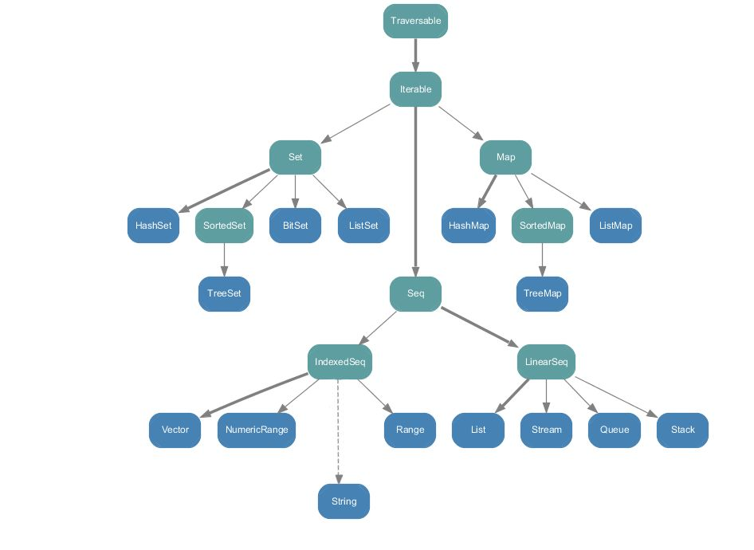
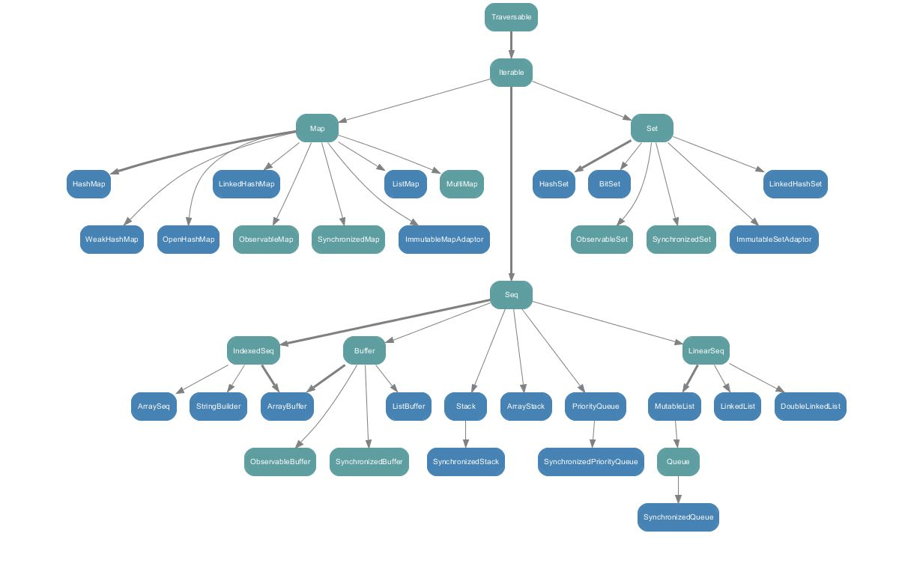

<!-- START doctoc generated TOC please keep comment here to allow auto update -->
<!-- DON'T EDIT THIS SECTION, INSTEAD RE-RUN doctoc TO UPDATE -->
**Table of Contents**  *generated with [DocToc](https://github.com/thlorenz/doctoc)*

- [Scala语言入门](#scala%E8%AF%AD%E8%A8%80%E5%85%A5%E9%97%A8)
  - [环境配置](#%E7%8E%AF%E5%A2%83%E9%85%8D%E7%BD%AE)
  - [IDEA环境配置](#idea%E7%8E%AF%E5%A2%83%E9%85%8D%E7%BD%AE)
  - [变量与数据类型](#%E5%8F%98%E9%87%8F%E4%B8%8E%E6%95%B0%E6%8D%AE%E7%B1%BB%E5%9E%8B)
  - [运算符、控制流](#%E8%BF%90%E7%AE%97%E7%AC%A6%E6%8E%A7%E5%88%B6%E6%B5%81)
  - [函数式编程](#%E5%87%BD%E6%95%B0%E5%BC%8F%E7%BC%96%E7%A8%8B)
  - [包管理](#%E5%8C%85%E7%AE%A1%E7%90%86)
  - [面向对象](#%E9%9D%A2%E5%90%91%E5%AF%B9%E8%B1%A1)
  - [集合](#%E9%9B%86%E5%90%88)
  - [模式匹配](#%E6%A8%A1%E5%BC%8F%E5%8C%B9%E9%85%8D)
  - [异常处理](#%E5%BC%82%E5%B8%B8%E5%A4%84%E7%90%86)
  - [隐式转换](#%E9%9A%90%E5%BC%8F%E8%BD%AC%E6%8D%A2)
  - [泛型](#%E6%B3%9B%E5%9E%8B)
  - [总结](#%E6%80%BB%E7%BB%93)

<!-- END doctoc generated TOC please keep comment here to allow auto update -->

# Scala语言入门

Scala（发音为/ˈskɑːlə, ˈskeɪlə/）是一门多范式的编程语言，设计初衷是要集成面向对象编程和函数式编程的各种特性。洛桑联邦理工学院的Martin Odersky于2001年基于Funnel的工作开始设计Scala。Java平台的Scala于2003年底/2004年初发布。

特点：
- 同样运行在JVM上，可以与现存程序同时运行。
- 可直接使用Java类库。
- 同Java一样静态类型。
- 语法和Java类似，比Java更加简洁（简洁而并不是简单），表达性更强。
- 同时支持面向对象、函数式编程。
- 比Java更面向对象。

关注点：
- 类型推断、不变量、函数式编程、高级程序构造。
- 并发：actor模型。
- 和现有Java代码交互、相比Java异同和优缺。

和Java关系：
```
        javac               java
.java --------> .class ----------> run on JVM
.scala -------> .class ----------> run on JVM
        scalac              scala
```

测试代码：[Scala分支](../../tree/Scala/)

阅读：
- [尚硅谷大数据技术之Scala入门到精通教程](https://www.bilibili.com/video/BV1Xh411S7bP)（本文参考）

## 环境配置

Scala需要依赖Java，访问[这里](https://docs.scala-lang.org/overviews/jdk-compatibility/overview.html)查看特定Scala版本依赖的Java版本。这里选择，最新的JDK17配合Scala2.13.6。

Windows中下载安装配置环境变量：
- 类似于java配置`SCALA_HOME`为安装目录。
- 添加`%SCALA_HOME%\bin`到path环境变量。

Linux中类似，可以使用包管理器，但如果依赖版本不严格一致的话，需要官网下载对应版本安装即可。

也有交互式执行环境：
```
scala
```

交互式执行环境中的传统艺能：
```scala
println("hello,world!")
```

暂时不管项目配置，还是单文件编译执行为主，项目开发肯定要以包的形式组织可以使用IntelliJ IDEA开发，使用maven或者sbt进行项目配置。

使用VSCode编辑器，安装插件Scala Syntax (official)和Scala (Mentals)。

新建文件`HelloScala.scala`。
```scala
object HelloScala { // HelloScala is a object, not a class, will create a 
    def main(args : Array[String]) : Unit = {
        println("hello,world!");
    }
}
```

可以使用插件CodeRunner直接快捷键运行。也可以在命令行编译为字节码后再运行：
```
scalac HelloScala.scala
scala helloScala
```
或者直接运行scala源文件：
```
scala HelloScala.scala
```
和java如出一辙。

如果编译的话会生成2个`.class`字节码文件，`HelloScala.class`和`HelloScala$.class`。都是字节码但是不能通过`java`直接运行。但对于HelloWorld这个例子来说，java源代码编译而成的字节码是可以通过`scala`命令运行的。

原因是没有引入Scala的库，添加`classpath`就可以通过java执行scala编译成的字节码了：
```
java -cp %SCALA_HOME%/lib/scala-library.jar; HelloScala
```
使用[Java Decompiler](http://java-decompiler.github.io/)反编译字节码到java源文件可以看到引入Scala库的逻辑。并且：
- scala源文件中的`HelloScala`对象编译后成为了一个类，但对象本身编译后就是生成的另一个类`HelloScala$`类的单例对象`HelloScala$.MODULE$`，称之为伴生对象。
- `HelloScala$`有一个`main`实例方法，`HelloScala`类的静态方法通过这个单例对象转调这个实例方法。完成打印。
- Scala比Java更面向对象。

## IDEA环境配置

使用IntelliJ IDEA：
- 创建Maven项目，JDK版本17。
- 安装插件：Scala。一般默认都已经装了。
- Maven项目默认用Java写，在`main/`目录下新建目录`scala/`，然后将目录标记为Source Root。
- 这样甚至可以在同一个项目中混用Scala和Java源文件，并互相调用。
- 需要能够添加scala源文件，右键项目，添加框架支持，配置Scala SDK，选择，然后就可以右键添加Scala源文件了。
- 添加包，添加Scala类，选择对象，编辑源码。
```scala
package VeryStarted

object HelloWorld {
  def main(args: Array[String]): Unit= {
    println("Hello,world!")
  }
}
```
- Ctrl + Shift + F10运行。
- 可以看到执行的命令是`java`在`classpath`中引入了Scala的`jar`包形式的库。
- 调用java的类库：
```scala
package VeryStarted

object HelloWorld {
  def main(args: Array[String]): Unit= {
    println("Hello,world!")
    System.out.println("Hello,world! from java")
  }
}
```

语法含义：
```scala
object SingletonObject { body }
def MethodName(ArgName: ArgType): RetType = { body }
```

`object`关键字创建的伴生对象，可以理解为替代Java的`static`关键字的方式，将静态方法用单例对象的实例方法做了替代，做到了更纯粹的面向对象。

仅仅测试理解语法既可以单文件编写VSCode编译执行也可以用IDEA管理项目，影响不大。

再用一个等价的类定义来认识和区别一下Scala和Java：

java:
```java
public class Student {
    private String name;
    private Integer age;
    private static String school = "XDU";

    public Student(String name, Integer age) {
        this.name = name;
        this.age = age;
    }

    public void printInfo() {
        System.out.println(this.name + " " + this.age + " " + Student.school);
    }

    // psvm
    public static void main(String[] args) {
        Student tch = new Student("tch", 20);
        tch.printInfo();
    }
}
```
scala:
```scala
package VeryStarted

class Student(name: String, age: Int) {
  def printInfo(): Unit = {
    println(name + " " + age + " " + Student.school)
  }
}

// 引入伴生对象，名称一致，同一个文件
object Student {
  val school: String = "XDU"

  def main(args: Array[String]): Unit = {
    val tch = new Student("tch", 20)
    tch.printInfo()
  }
}
```

Scala库源码与API文档：
- 官网上下载下载Scala源码，解压到Scala安装目录或任意位置。
- IntelliJ IDEA进入反编译的源码后选择右上角附加源码，选择源码的`src/`目录。
- 安装包里面已经有了文档，没有的话可以单独下载。
- Scala依赖Java，某些类型就是Java的包装，库中有一部分java源码。

## 变量与数据类型

注释：
- 和java一样
- `//` 单行
- `/* */` 多行
- `/** */` 文档，方法或者类前面，便于`scaladoc`生成文档。

变量和常量：
```scala
var name [:VariableType] = value // variable
val name [:ConstantType] = value // constant
```
因为Scala的函数式编程要素，所以一个指导意见就是能用常量就不要用变量。
- 声明变量时，类型可以省略，编译器会自动推导。
- 静态类型，类型经过给定或推导确定后就不能修改。
- 变量和常量声明时，必须有初始值。
- 变量可变，常量不可变。
- 引用类型常量，不能改变常量指向的对象，可以改变对象的字段。
- 不以`;`作为语句结尾，scala编译器自动识别语句结尾。

标识符命名规范：
- 字母下划线开头，后跟字母数字下划线，和C/C++/Java一样。
- 操作符开头，且只包含(+-*/#!等)，也是有效的标识符。这样用会用什么奇怪的好处吗？答案是灵活到天顶星的运算符重载。
- 用反引号包括的任意字符串，即使是同39个Scala关键字同名也可以。有点奇怪的用法，尚不知道为什么。

```scala
var _abc:String = "hello"
val -+/%# = 10
val `if` = 10
println(_abc)
println(-+/%#)
println(`if`)
```

关键字：
- `package import class obejct trait extends with type for`
- `private protected abstract sealed final implicit lazy override`
- `try catch finlly throw`
- `if else match case do while for return yield`
- `def var val`
- `this super`
- `new`
- `true false null`
- 其中Java没有的关键字：`object trait with implicit match yield def val var`

字符串：
- 类型：`String`
- `+`号连接
- `*`字符串乘法，复制一个字符串多次
- `printf`格式化输出
- 字符串插值：`s"xxx${varname}"`前缀`s`模板字符串，前缀`f`格式化模板字符串，通过`$`获取变量值，`%`后跟格式化字符串。
- 原始字符串：`raw"rawstringcontents${var}"`，不会考虑后跟的格式化字符串。
- 多行字符串：`""" """`。
- 输出：`print printf println ...`
```scala
val name: String = "Pyrrha" + " " + "Nikos"
val age = 17
println((name + " ") * 3)
printf("%s : dead in %d\n", name, age)
print(s"$name : dead in ${age}")
val power = 98.9072
println(f" : power ${power}%.2f.")

var sql = s"""
    |Select *
    |from 
    |   Student
    |Where
    |   name = ${name}
    |and
    |   age >= ${age}
""".stripMargin // strip | and whitespaces before |
println(sql)
```

输入：
- `StdIn.readLine()`
- `StdIn.readShort() StdIn.readDouble`
- `import scala.io.StdIn`
```scala
println("input name:")
val name: String = StdIn.readLine()
println("input age:")
val age:Int = StdIn.readInt()
println(name + " : " + age)
```

读写文件：
```scala
import scala.io.Source
import java.io.PrintWriter
import java.io.File
object FileIO {
    def main(args: Array[String]): Unit ={
        // read from file
        Source.fromFile("FileIO.txt").foreach(print)

        // write to file
        // call java API to write
        val writer = new PrintWriter(new File("WFile.txt"))
        writer.write("Nephren!")
        writer.close()
    }
}
```

数据类型：
- java基本类型`char byte short int long float double boolean`。
- java基本类型对应包装类型：`Charater Byte Short Integer Long Float Double Boolean`。
- java中不是纯粹的面向对象。
- Scala吸取了这一点，所有数据都是对象，都是`Any`的子类。
- `Any`有两个子类：`AnyVal`值类型 `AnyRef`引用类型。
- 数值类型都是`AnyVal`子类，和Java数值包装类型都一样，只有整数在scala中是`Int`、字符是`Char`有点区别。
- `StringOps`是java中`String`类增强，`AnyVal`子类。
- `Unit`对应java中的`void`，`AnyVal`子类。用于方法返回值的位置，表示方法无返回值，`Unit`是一个类型，只有一个单例的对象，转成字符串打印出来为`()`。
- `Void`不是数据类型，只是一个关键字。
- `Null`是一个类型，只有一个单例对象`null`就是空引用，所有引用类型`AnyRef`的子类，这个类型主要用途是与其他JVM语言互操作，几乎不在Scala代码中使用。
- `Nothing`所有类型的子类型，也称为底部类型。它常见的用途是发出终止信号，例如抛出异常、程序退出或无限循环。


整数类型：都是有符号整数，标准补码表示。
- `Byte` 1字节
- `Short` 2字节
- `Int` 4字节
- `Long` 8字节
- 整数赋初值超出表示范围报错。
- 自动类型推断，整数字面值默认类型`Int`，长整型字面值必须加`L`后缀表示。
- 直接向下转换会失败，需要使用强制类型转换，`(a + 10).toByte`。

浮点类型：
- `Float` IEEE 754 32位浮点数
- `Double` IEEE 754 64位浮点数
- 字面值默认`Double`

字符类型：
- 同java的`Character`，2字节，UTF-16编码的字符。
- 字符常量：`''`
- 类型`Char`
- 转义：`\t \n \r \\ \" \'`etc

布尔类型：`true false`

空类型：
- `Unit` 无值，只有一个实例，用于函数返回值。
- `Null` 只有一个实例`null`，空引用。
- `Nothing` 确定没有正常的返回值，可以用Nothing来指定返回值类型。好像意思是抛异常时返回Nothing，不是特别懂。
```scala
object NullType {
    def main(arg : Array[String]) : Unit = {
        // Unit
        def f1(): Unit = {
            println("just nothing!")
        }
        val a = f1()
        println(a) // ()

        // null only used for AnyRef
        // val n:Int = null // invalid
    }
}
```

数据类型转换：
- 自动类型提升：多种数据类型混合运算，自动提升到精度最大的数据类型。
- 高精度赋值到低精度，直接报错。
- 除了图中的隐式类型转换，都需要强制类型转换。
- `Byte Short Char`计算时会直接提升为`Int`。
- `Boolean`不能参与整数浮点运算，不能隐式转换为整数。


强制类型转换：
- `toByte toInt toChar toXXXX`
- `'a'.toInt` `2.7.toInt`
- 数值与String的转换：`"" + n` `"100".toInt` `"12.3".toFloat` `12.3".toDouble.toInt`
- 整数强转是二进制截取，整数高精度转低精度可能会溢出，比如`128.toByte`。

Scala标准库：
- `Int` `Double`这些数据类型对应于Java中的原始数据类型，在底层的运行时不是一个对象，但Scala提供了从这些类型到`scala.runtime.RichInt/RichDouble/...`的（低优先级）隐式类型转换（在`Perdef`中定义），从而提供了非原始类型具有的对象操作。
- 基本类型都是默认导入的，不需要显式导入，位于包`scala`中。还有`scala.Predef`对象也是自动导入。
- 其他需要导入的包：
    - `scala.collection`集合。
    - `scala.collection.immutable`不可变数据结构，比如数组、列表、范围、哈希表、哈希集合。
    - `scala.collection.mutable`可变数据结构，数组缓冲、字符串构建器、哈希表、哈希集合。
    - `scala.collection.concurrent`可变并发数据结构，比如字典树。
- `scala.concurrent`原始的并发编程。
- `scala.io`输入输出。
- `scala.math`基本数学操作。
- `scala.sys`操作系统交互。
- `scala.util.matching`正则。
- 标准库中的其他部分被放在独立的分开的库中。可能需要单独安装，包括：
- `scala.reflect`反射API。
- `scala.xml`xml解析、操作、序列化。
- `scala.collection.parallel`并行集合。
- `scala.util.parsing` parser的组合子，什么东西？
- `scala.swing`java的GUI框架Swing的封装。
- 定义了一些别名给常用的类，比如`List`是`scala.collection.immutable.List`的别名，也可以理解为默认导入？
- 其他别名可能是底层平台JVM提供的，比如`String`是`java.lang.String`的别名。

## 运算符、控制流

运算符：
- 和Java基本相同。
- 算术运算：`+ - * / %` ，`+`可以用于一元正号，二元加号，还可以用作字符串加法，取模也可用于浮点数。没有自增和自减语法`++ --`。
- 关系运算：`== != < > <= >=`
- 逻辑运算：`&& || !`， `&& ||`所有语言都支持短路求值，scala也不例外。
- 赋值运算：`= += -= *= /= %=`
- 按位运算：`& | ^ ~`
- 移位运算：`<< >> >>>`，其中`<< >>`是有符号左移和右移，`>>>`无符号右移。
- scala中所有运算符本质都是对象的方法调用，拥有比C++更灵活的运算符重载。

自定义运算符：
- Scala中运算符即是方法，任何具有单个参数的方法都可以用作**中缀运算符**，写作中缀表达式的写法。`10.+(1)`即是`10 + 1`。
- 定义时将合法的运算符（只有特殊符号构成的标识符）作为函数名称即可定义。

运算符优先级：
- 当一个表达式使用多个运算符时，将**根据运算符的第一个字符来评估优先级**。内置的运算符和自定义运算符都是函数，遵守同样的规则。
```scala
(characters not shown below)
* / %
+ -
:
= !
< >
&
^
|
(all letters, $, _)
```
- 比如下面两个表示等价：
```scala
a + b ^? c ?^ d less a ==> b | c
((a + b) ^? (c ?^ d)) less ((a ==> b) | c)
```

上面都是粗浅的理解，以下引用自[Scala2.13标准 - 06表达式 - 12前缀中缀和后缀操作](https://www.scala-lang.org/files/archive/spec/2.13/06-expressions.html#prefix-infix-and-postfix-operations)一节：

词法：
```bnf
PostfixExpr     ::=  InfixExpr [id [nl]]
InfixExpr       ::=  PrefixExpr
                  |  InfixExpr id [nl] InfixExpr
PrefixExpr      ::=  ['-' | '+' | '!' | '~'] SimpleExpr
```
- 可以看到前缀运算符只有`- + ! ~`含义是正负号、逻辑非、按位取反。
- 表达式是通过运算符和操作数构建的。

前缀运算：
- 仅有`+ - ! ~`，等价于后缀的方法调用`.+() .-() .!() .~()`
- 前缀运算符的操作数是**原子**的，比如`-sin(x)`被解析为`-(sin(x))`。这不同于一般的函数，如果定义一个相同含义的`negate`函数，那么`negate sin(x)`会被解析为`sin`是操作符，而`negate`和`(x)`是它的操作数。

后缀运算：
- 后缀的运算符可以是任意的标识符，所有的`e op`被解释为`e.op`。原来还可以这样！

中缀运算：
- 一个中缀运算符可以是任意的标识符，中缀运算符
- 中缀运算符的优先级定义如下：递增顺序，优先级由运算符首字符确定，同一行拥有同等优先级。
```scala
(all letters, as defined in [chapter 1], including `_` and `$`)
|
^
&
= !
< >
:
+ -
* / %
(other operator characters, as defined in [chapter 1], including Unicode categories `Sm` and `So`)
```
- 运算符的结合性由运算符的尾字符确定，以`:`结尾的字符为右结合，其他的都是左结合。后面的集合操作运算符中有例子。
- 优先级和结合性决定了一个表达式的语义，也即是它的组合方式。具体规则：
    - 多个中缀运算符同时出现，优先级更高的更显绑定到操作数。
    - 如果有多个连续的同一优先级的中缀运算符（同一优先级结合性必定相同），那么按照结合性绑定，左结合从左往右，右结合从右往左。
    - 后缀运算符总是比中缀运算符优先级更低。比如`e1 op1 e2 op2`总是解释为`(e1 op1 e2) op2`。
- 中缀的左结合的运算符可能包含多个参数，`e op (e1, e2, ..., en)`总是被解释为`e.op(e1, e2, ..., en)`。
- 对于中缀表达式`e1 op e2`，如果`op`左结合那么被解释为`e1.op(e2)`，如果右结合并且是它的参数是传名参数那么被解释为`e2.op(e1)`，如果参数是值传递，那么解释为`{val x = e2; e2.op(x)}`，其中x是一个新名称。后面的集合操作有例子。
- 前面所说的前缀运算、后缀运算、中缀运算对应的运算符分别是一元前置运算符、一元后置运算符、二元后置运算符，不存在其他类型，比如三元的条件运算符。

赋值运算符：
- 赋值运算符是指以`=`结尾的运算符。除了同样以`=`开始，和`>= <= !=`之外。
- 赋值运算符在当其他的解释都非法时会有特殊对待。
- 比如说`l += r`，如果没有显式定义的`+=`运算符，那么会被解释为`l = l + r`。
- 这种重新解释发生在满足以下两个条件的情况下：
    - `l`没有`+=`运算符。
    - `l = l + r`是类型正确的，通常情况下这意味着`l`是一个左值，并且`l + r`是合法的（定义了`+`或者可隐式转换为定义了`+`的类型）。

试验与总结：
- 内置前缀运算符有`+ - ! ~`对少量内置类型提供支持，自定义一元前缀请使用`unary_`加上要定义的运算符名称，并且不要加参数列表`()`。而且这东西真的可以加参数列表，但我并没有找到用运算符形式调用的方式。
- 自定义一元后置运算符（即定义为空参数列表）需要引入`scala.language.postfixOps`才能使用后缀运算符形式调用。当然用函数调用形式调用总是没有语法问题的。同样去掉参数列表后就可以后置使用。
- 二元后置运算符，是最常用的自定义运算符。优先级上面有，结合性以是否`:`结尾确定。需要特别注意的是右结合和比如C++中重载赋值运算符是有区别的，需要了解。
- Scala中内置的赋值运算符返回空`()`，所以其实是不能连续赋值的，赋值类运算符算是被特殊对待了。并且因为推崇函数式编程风格，能定义为`val`则定义为`val`也就不能连续赋值。因为变量都是引用变量，定义`=`变成了没有道理也不可能的一件事情，所以实践中也只能一条语句只做一次赋值。
- Scala不能定义`=`运算符，但可以定义复合赋值，并且做了处理，某些情况下只要类设计得好定义了运算类运算符就不需要多去定义复合赋值了。所以说如果真要定义复合赋值返回值也应该返回`()`吗？也许是的。
- 多参数的方法其实也可以写成中缀形式，`e op (e1, e2, ..., en)`。
- 对于类方法来说，**运算符是函数，函数也是运算符**。

例子：可窥见其灵活程度。
```scala
import scala.language.postfixOps
object UserDefindOps {
    def main(args: Array[String]): Unit = {
        val v = Vector2(10, 5)
        val v2 = Vector2(5, 10)

        println(v)
        // prefix unary
        println("==========================================")
        println(+v)
        println(-v)
        println(v.unary_-("hello"))

        // binary
        println("==========================================")
        println(v * 3)
        println(v * v2)
        println(v + v2)
        println(v - v2)
        
        // postfix unary, just for test, no meaning
        println("==========================================")
        println(v-)
        println((v-)-)

        // multiple
        println("==========================================")
        println(v hello ("test", "yes"))
        println(v + (10, 10))
        println(v - (10, 10))

        // assignment operator
        println("==========================================")
        var v3 = Vector2(10, 5)
        println(v3 *= 3) // ()
        println(v3) // Vector2(30.0, 15.0)
        v3 /= 3
        println(v3)
        v3 += v2
        println(v3)
        v3 += (10, 10)
        println(v3)
    }
}

class Vector2(val x: Double, val y: Double) {
    override def toString(): String = s"Vector2($x, $y)"
    // prefix unary
    def unary_- = this.- // call postfix -
    def unary_+ = Vector2(x, y)
    def unary_-(str: String) = s"unary - with a string parameter: $str" // can not call this through operator format
    // binary
    def +(v: Vector2) = Vector2(x + v.x, y + v.y)
    def -(v: Vector2) = Vector2(x - v.x, y - v.y)
    def *(v: Vector2) = x * v.x + y * v.y // Inner product 
    def *(d: Double) = Vector2(d * x, d * y) // multiply
    def /(d: Double) = Vector2(x / d, y / d)
    // postfix unary
    def - = Vector2(-x, -y)
    // multiple
    def hello(a: String, b: String) = s"$a, $b, ${toString()}"
    def +(_x: Double, _y: Double): Vector2 = this + Vector2(_x, _y)
    def -(_x: Double, _y: Double): Vector2 = Vector2(x - _x, y - _y)
}

object Vector2 {
    def apply(x: Double, y: Double) = new Vector2(x, y)
}
```

实践指南：
- 一元前缀和一元后缀运算符定义时不加参数列表，运算符形式使用。
- 在复杂表达式中使用一元前缀和后缀运算符使用时最好加括号表明优先级，不然在复杂表达式中编译器可能难以区分这是一元的还是二元的。
- 二元运算符定义只给一个参数，运算符形式使用。
- 参数多于1个时不要通过运算符形式使用，但如果很清晰的话其实也无妨。
- 函数也是运算符，非特殊符号运算符形式使用也可以很有用，表达能力很强，比如`1 to 10`。
- 不要滥用，用到都搞不清谁是运算符谁是操作数就不好了。
- 经验尚浅，还需多实践。

## 控制流

`if-else`：
```scala
if (condition) {
    xxx
} else if (condition) {
    xxx
} else {
    xxx
}
```
- scala中特殊一点，`if-else`语句也有返回值，也就是说也可以作为表达式，定义为执行的最后一个语句的返回值。
- 可以强制要求返回`Unit`类型，此时忽略最后一个表达式的值，得到`()`。
- 多种返回类型的话，赋值的目标变量类型需要指定为具体公共父类，也可以自动推断。
- scala中没有三元条件运算符，可以用`if (a) b else c` 替代`a ? b : c`。
- 嵌套条件同理。

`for`循环，也叫`for`推导式：
- 范围遍历：`for(i <- 1 to 10) {}`，其中`1 to 10`是`Int`一个方法调用，返回一个`Range`。
- 范围`1 to 10` `1 until 10`是包含右边界和不包含右边界的范围，也可以直接用`Range`类。
- 范围步长`1 to 10 by 2`。
- 范围也是一个集合，也可以遍历普通集合：`for(i <- collection) {}`
- 循环守卫：即循环保护式，或者叫条件判断式，循环守卫为`true`则进入循环体内部，为`fasle`则跳过，类似于`continue`。
    - 写法：
    ```scala
    for(i <- collection if condition) {
    }
    ```
    - 等价于：
    ```scala
    if (i <- collection) {
        if (condition) {
        }
    }
    ```
- 嵌套循环同理。嵌套循环可以将条件合并到一个`for`中：
    - 标准写法：
    ```scala
    for (i <- 1 to 4) {
            for (j <- 1 to 5) {
                println("i = " + i + ", j = " + j)
            }
        }
    ```
    - 等价写法：
    ```scala
    for (i <- 1 to 4; j <- 1 to 5) {
            println("i = " + i + ", j = " + j)
        }
    ```
    - 典型例子，乘法表：
    ```scala
    for (i <- 1 to 9; j <- 1 to i) {
        print(s"$j * $i = ${i * j} \t")
        if (j == i) println()
    }
    ```
- 循环中的引入变量，但不是循环变量：
    ```scala
    for (i <- 1 to 10; j = 10 - i) {
        println("i = " + i + ", j = " + j)
    }
    ```
- 循环条件也可以用`{}`
    - 上面的引入变量循环等价于：
    ```scala
    for {
        i <- 1 to 10
        j = 10 - i
    } {
        println("i = " + i + ", j = " + j)
    }
    ```
- 循环同样有返回值，返回值都是空，也就是`Unit`实例`()`。
- 循环中同样可以用`yield`返回，外面可以接住用来操作，循环暂停，执行完后再继续循环。就像Ruby/Python。
    ```scala
    val v = for (i <- 1 to 10) yield i * i // default implementation is Vector, Vector(1, 4, 9, 16, 25, 36, 49, 64, 81, 100)
    ```

`while`和`do while`：
- 为了兼容java，不推荐使用，结果类型是`Unit`。
- 不可避免需要声明变量在循环外部，等同于循环内部对外部变量造成了影响，所以不推荐使用。
```scala
while (condition) {
}
do {
} while (condition)
```

循环中断：
- Scala内置控制结构去掉了`break continue`关键字，为了更好适应函数式编程，推荐使用函数式风格解决。
- 使用`breakable`结构来实现`break continue`功能。
- 循环守卫可以一定程度上替代`continue`。
- 可以用抛出异常捕获的方式退出循环，替代`break`。
    ```scala
    try {
        for (i <- 0 to 10) {
            if (i == 3)
                throw new RuntimeException
            println(i)
        }
    } catch {
        case e: Exception => // do nothing
    }
    ```
- 可以使用Scala中的`Breaks`类中的`break`方法（只是封装了异常捕获），实现异常抛出和捕获。
    ```scala
    import scala.util.control.Breaks
    Breaks.breakable(
        for (i <- 0 to 10) {
            if (i == 3)
                Breaks.break()
            println(i)
        }
    )
    ```

## 函数式编程

不同范式对比：
- 面向过程：按照步骤解决问题。
- 面向对象：分解对象、行为、属性，通过对象关系以及行为调用解决问题。耦合低，复用性高，可维护性强。
- 函数式编程：面向对象和面向过程都是命令式编程，但是函数式编程不关心具体运行过程，而是关心数据之间的映射。纯粹的函数式编程语言中没有变量，所有量都是常量，计算过程就是不停的表达式求值的过程，每一段程序都有返回值。不关心底层实现，对人来说更好理解，相对地编译器处理就比较复杂。
- 函数式编程优点：编程效率高，函数式编程的不可变性，对于函数特定输入输出是特定的，与环境上下文等无关。函数式编程无副作用，利于并行处理，所以Scala特别利于应用于大数据处理，比如Spark，Kafka框架。

函数定义：
```scala
def func(arg1: TypeOfArg1, arg2: ...): RetType = {
    ...
}
```
- 函数式编程语言中，函数是一等公民（可以像对象一样赋值、作为参数返回值），可以在任何代码块中定义函数。
- 一般将定义在类或对象中（最外层）的函数称为方法，而定义在方法中（内层）的称为函数。广义上都是函数。
- 返回值用`return`返回，不写的话会使用最后一行代码作为返回值。
- 无返回值`Unit`时可以用`return`可以用`return ()`可以不返回。
- 其他时候只需要返回值是返回值类型的子类对象就行。

术语说明：
- java中不提函数的说法，而是说类或者实例方法，不涉及一般化的函数。
- 函数式编程中的函数二字来源于数学上的函数，也就是映射，集合和集合之间的关系，强调数据之间的映射关系。
- 而编程语言中的函数，也包括scala中的函数定义都是指的一个完成特定功能的子程序（subroutine），并不等同于数学意义上的函数。

函数参数：
- 可变参数，类似于Java，使用数组包装。
    - `def f4(str:String*): Unit = {}`。
    - 如果除了可变参数还有其他参数，需要将可变参数放在末尾。
    - 可变参数当做数组来使用。
- 参数默认值:
    - `def f5(name: String = "alice"): Unit = {}`
    - 和C++一样，默认参数可以不传，默认参数必须全部放在末尾。
- 带名称传参：
    - 调用时带名称。
    ```scala
    def f6(name: String, age: Int = 20, loc: String = "BeiJing"): Unit = {
        println(s"name ${name}, age ${age}, location ${loc}")
    }
    f6("Bob")
    f6("Alice", loc = "Xi'An")
    f6("Michael", 30)
    ```
    - 不给名称的就是按顺序赋值。
    - 调用时带名参数必须位于实参列表末尾。
    - 和默认参数一起使用会很方便，比如有多个默认参数，但只想覆盖其中一个。

函数至简原则：
- 能省则省。
- 最后一行代码会作为返回值，可以省略`return`。
- 函数体只有一行代码的话，可以省略花括号。
- 如果返回值类型能够自动推断那么可以省略。
- 如果函数体中用`return`做返回，那么返回值类型必须指定。
- 如果声明返回`Unit`，那么函数体中使用`return`返回的值也不起作用。
- 如果期望是无返回值类型，那么可以省略`=`。这时候没有返回值，函数也可以叫做过程。【2.13.0已废弃，能编过不过会提示。】
- 无参函数如果声明时没有加`()`，调用时可以省略`()`。【如果声明时有`()`调用也可以省略，不过2.13.3废弃了。】
- 不关心函数名称时，函数名称和`def`也可以省略，去掉返回值类型，将`=`修改为`=>`定义为匿名函数。
    ```scala
    val fun = (name: String) => { println("name") }
    ```

匿名函数：
- 没有名称的函数，可以被赋值给一个量。也叫lambda表达式
- `val fun = (name: String) => { println("name") }`
- 匿名函数定义时不能有函数的返回值类型。
- 简化原则：
    - 参数的类型可以省略，如果可以根据高阶函数形参自动推导。
    - 类型省略之后如果只有一个参数，那么可以省略参数列表的`()`，`name => println(name)`。
    - 匿名函数函数体只要一行，那么`{}`可以省略。
    - 如果参数只出现一次，则参数可以省略，后面出现的参数用`_`代替，`println(_)`也是一个lambda，表示`name => {println(name)}`。
    - 如果可以推断出当前传入的`println`是一个函数体，而不是函数调用语句，那么可以省略下划线。也就是省略了转调，直接将函数名称作为参数传递。
    ```scala
    def f(func: String => Unit): Unit = {
        func("alice")
    }
    f((name: String) => { println(name) })
    f((name) => println(name))
    f(println(_))
    f(println)
    ```
- 例子：省得太极端就没有可读性了。
```scala
def dualOp(func: (Int, Int) => Int): Int = {
    func(1, 2)
}
println(dualOp((a: Int, b: Int) => a + b))
println(dualOp((a: Int, b: Int) => a - b))
println(dualOp((a, b) => a - b))
println(dualOp(_ + _)) // a + b
println(dualOp(-_ + _)) // -a + b
```

高阶函数：
- 三种形式：函数作为值传递、函数作为参数、函数作为返回值。
- 作为值传递：经过赋值之后在底层变成一个lambda对象。
```scala
// define function
def foo(n: Int): Int = {
    println("call foo")
    n + 1
}
// function assign to value, also a object
val func = foo _ // represent the function foo, not function call
val func1: Int => Int = foo // specify the type of func1
println(func) // Main$$$Lambda$674/0x000000080103c588@770beef5
println(func == func1) // false, not a same object
```
- 函数作为参数，上面展示过了。可以传匿名函数、函数名称、lambda对象。
```scala
// function as arguments
def dualEval(op: (Int, Int) => Int, a: Int, b: Int) = {
    op(a, b)
}
def add(a: Int, b: Int): Int = a + b
println(dualEval(add, 10, 100))
val mul:(Int, Int) => Int = _ * _
println(dualEval(mul, 10, 100))
println(dualEval((a, b) => a + b, 1000, 24))
```
- 函数作为返回值：
```scala
// function as return value
def outerFunc(): Int => Unit = {
    def inner(a: Int): Unit = {
        println(s"call inner with argument ${a}")
    }
    inner // return a function
}
println(outerFunc()(10)) // inner return ()
```
- 现在就可以套娃了，比如定义一个返回一个返回函数的函数的函数。

高阶函数举例：
- 使用特定操作处理数组元素，得到新数组。也就是集合处理的map（映射）操作。
```scala
// deal with an array, get a new array
// map operation of array
def arrayOp(arr: Array[Int], op: Int => Int): Array[Int] = {
    for (elem <- arr) yield op(elem) // the whole for expression get a new array
}
val arr = Array(1, 2, 3, 4)
def addOne(elem: Int): Int = elem + 1
println(arrayOp(arr, addOne _).mkString(", ")) // pass addOne also work
println(arrayOp(arr, elem => elem * 2).mkString(", "))
println(arrayOp(arr, _ * 3).mkString(", "))
```
- 套娃：
```scala
def func(a: Int): String => (Char => Boolean) = {
    def f1(s: String): Char => Boolean = {
        def f2(c: Char): Boolean = { 
            if (a == 0 && s == "" && c == '0') false else true
        }
        f2
    }
    f1
}
println(func(0)("")('0')) // false
println(func(1)("hello")('c')) // true
```
- 上面的例子经过极致简写：只能说类型推导也太强大了。**内层函数可以使用外层函数的参数**。
```scala
// simplify to anonymous function
def func1(a: Int): String => (Char => Boolean) = {
    s => c => !(a == 0 && s == "" && c == '0')
}
println(func1(0)("")('0')) // false
println(func1(1)("hello")('c')) // true
```
- 柯里化之后：
```scala
// Currying 
def func2(a: Int)(s: String)(c: Char): Boolean = !(a == 0 && s == "" && c == '0')
println(func2(0)("")('0')) // false
println(func2(1)("hello")('c')) // true
```

**函数柯里化**和**闭包**：**重点**。

闭包：如果一个函数，访问到了它的外部（局部）变量的值，那么这个函数和他所处的环境，称为闭包。

- [闭包](https://zh.wikipedia.org/wiki/%E9%97%AD%E5%8C%85_(%E8%AE%A1%E7%AE%97%E6%9C%BA%E7%A7%91%E5%AD%A6))的定义：
> 在计算机科学中，闭包（英语：Closure），又称词法闭包（Lexical Closure）或函数闭包（function closures），是在支持[头等函数](https://zh.wikipedia.org/wiki/%E5%A4%B4%E7%AD%89%E5%87%BD%E6%95%B0)的编程语言中实现词法绑定的一种技术。闭包在实现上是一个结构体，它存储了一个函数（通常是其入口地址）和一个关联的环境（相当于一个符号查找表）。环境里是若干对符号和值的对应关系，它既要包括约束变量（该函数内部绑定的符号），也要包括自由变量（在函数外部定义但在函数内被引用），有些函数也可能没有自由变量。闭包跟函数最大的不同在于，当捕捉闭包的时候，它的自由变量会在捕捉时被确定，这样即便脱离了捕捉时的上下文，它也能照常运行。捕捉时对于值的处理可以是值拷贝，也可以是名称引用，这通常由语言设计者决定，也可能由用户自行指定（如C++）。
- 因为外层调用结束返回内层函数后，经过堆栈调整(比如在C中主调或者被调清理)，外层函数的参数已经被释放了，所以内层是获取不到外层的函数参数的。为了能够将环境（函数中用到的并非该函数参数的变量和他们的值）保存下来（需要考虑释放问题，可以通过GC可以通过对象生命周期控制，GC是一个常见选择），这时会将执行的环境打一个包保存到堆里面。

函数[柯里化](https://zh.wikipedia.org/wiki/%E6%9F%AF%E9%87%8C%E5%8C%96)（Currying）：将一个参数列表的多个参数，变成多个参数列表的过程。也就是将普通多参数函数变成高阶函数的过程。
- 定义：
>在计算机科学中，柯里化（英语：Currying），又译为卡瑞化或加里化，是把接受多个参数的函数变换成接受一个单一参数（最初函数的第一个参数）的函数，并且返回接受余下的参数而且返回结果的新函数的技术。在直觉上，柯里化声称“如果你固定某些参数，你将得到接受余下参数的一个函数”。柯里化是一种处理函数中附有多个参数的方法，并在只允许单一参数的框架中使用这些函数。
- scala中的柯里化函数定义：
```scala
// Currying 
def add(a: Int)(b: Int): Int = a + b
println(add(4)(3))
val addFour = add(4) _
// val addFour: Int => int = add(4)
println(addFour(3))
```

递归：
- 太常见了，不用过多介绍。
- 方法调用自身。
- 递归要有结束逻辑。
- 调用自身时，传递参数要有规律。
- scala中递归定义函数必须声明返回值类型，因为无法通过推导获得。
- 纯函数式语言比如Haskell，连循环都没有，很多操作都需要通过递归来做，性能比较依赖尾递归优化。
- scala中的尾递归优化例子：
```scala
def factorial(n: Int) : Int = {
    if (n < 0)
        return -1
    if(n == 0)
        return 1 
    factorial(n-1) * n
}
// tail recusion implementation of factorial
def tailFact(n: Int): Int = {
    if (n < 0)
        return -1
    @annotation.tailrec
    def loop(n: Int, curRes: Int): Int = {
        if (n == 0)
            return curRes
        loop(n - 1, curRes * n)
    }
    loop(n, 1)
}
```

控制抽象：
- 值调用：按值传递参数，计算值后再传递。多数语言中一般函数调用都是这个方式，C++还存在引用传递。
- 名调用：按名称传递参数，直接用实参替换函数中使用形参的地方。能想到的只有C语言中的带参宏函数，其实并不是函数调用，预处理时直接替换。
- 例子：
```scala
// pass by value
def f0(a: Int): Unit = {
    println("a: " + a)
    println("a: " + a)
}
f0(10)

// pass by name, argument can be a code block that return to Int
def f1(a: => Int): Unit = {
    println("a: " + a)
    println("a: " + a)
}
def f2(): Int = {
    println("call f2()")
    10
}
f1(10)
f1(f2()) // pass by name, just replace a with f2(), then will call f2() twice
f1({
    println("code block") // print twice
    30
})
```
- 应用：使用传名参数实现一个函数相当于while的功能。
```scala
// built-in while
var n = 10
while (n >= 1) {
    print(s"$n ")
    n -= 1
}
println()

// application: self-defined while, implement a function just like while keyword
def myWhile(condition: => Boolean): (=> Unit) => Unit = {
    def doLoop(op: => Unit): Unit = {
        if (condition) {
            op
            myWhile(condition)(op)
        }
    }
    doLoop _
}
n = 10
myWhile (n >= 1) {
    print(s"$n ")
    n -= 1
}
println()

// simplfy
def myWhile2(condition: => Boolean): (=> Unit) => Unit = {
    op => {
        if (condition) {
            op
            myWhile2(condition)(op)
        }
    }
}
n = 10
myWhile (n >= 1) {
    print(s"$n ")
    n -= 1
}
println()

// use currying
def myWhile3(condition: => Boolean)(op: => Unit): Unit = {
    if (condition) {
        op
        myWhile3(condition)(op)
    }
}
n = 10
myWhile3 (n >= 1) {
    print(s"$n ")
    n -= 1
}
println()
```

惰性加载：
- 当函数返回值被声明为`lazy`时，函数的执行将会被推迟，知道我们首次对此取值，该函数才会被执行。这种函数成为惰性函数。
```scala
def main(args: Array[String]): Unit = {
    // just like pass by name
    lazy val result: Int = sum(13, 47)
    println("before lazy load")
    println(s"result = ${result}") // first call sum(13, 47)
    println(s"result = ${result}") // result has been evaluated
}
def sum(a: Int, b: Int): Int = {
    println("call sum")
    a + b
}
```
- 有点像传名参数，但懒加载只是推迟求值到第一次使用时，而不是单纯替换。

## 包管理

关于Scala面向对象：
- Scala的面向对象思想源自Java，很多概念是一致的。
- 语法和java不同，补充了更多功能。

包：
- `package name`
- 作用：
    - 区分相同名字类，避免名称冲突。
    - 类很多时，分模块管理。
    - 访问权限控制。
- 命名：包名称只能是常规的标识符（字母数字下划线，数字不能开头）。同样`.`作为不同层级分割符，整体作为包名。
- 命名规范：一般情况下按照如下规则命名`com.company.projectname.modulename`，视项目规定而定，只是一个名称而已。
- scala中的两种包管理方式：
    - 第一种，java风格，每个源文件声明一个包，写在源文件最上方。但源文件位置不需要和包名目录层级一致，只代表逻辑层级关系，不像java一样源文件也必须按照包名目录层级关系放置。当然惯例是和java一样按照包名目录层级来放置。
    - 第二种，用`{}`嵌套风格定义包：
    ```scala
    package com {
        // code in com package
        object Outer {
            var name = "Outer"
        }
        package inner {
            // code in com.inner package
            package scala {
                // code in com.innner.scala package
                object Inner {
                    def main(args: Array[String]):Unit = {
                        println(Outer.name)
                        Outer.name = "Inner"
                        println(Outer.name)
                    }
                }
            }
        }
    } 
    ```
    - 嵌套风格好处：
        - 一个源文件可以声明多个并列的最顶层的包。
        - 子包中的类可以访问父包中的内容，无需导入。但外层是不能直接访问内层的，需要导入。
    - 如果单文件VsCode测试嵌套包，而不是用IDE的话，那定义了包就不能直接执行了，需要`scalac`先编译，并指定入口类运行。编译后的字节码文件和java一样会自动按照包层级关系排列。
    ```shell
    scalac PackageManagement.scala
    scala com.inner.scala.Inner 
    ```


包对象：
- 为scala包定义一个同名的单例包对象，定义在包对象中的成员，作为其对应包下的所有类和对象的共享变量，可以被直接访问，无需导入。
- 关键字`package object`，需要和包在同一层级下。比如为`com.inner`包定义包对象的话，必须在`com`包中，定义形式`package obejct inner { ... }`。

包的导入：
```scala
import users._      // 导入包 users 中的所有成员
import users.User   // 导入类 User
import users.{User, UserPreferences}      // 仅导入选择的成员
import users.{UserPreferences => UPrefs}  // 导入类并且设置别名
import users.{User => _, _}               // 导入出User类以外的所有users包中的内容
```
- 可以在任意位置导入（作用于代码块），可以设置别名，可以选择性导入想要导入的内容，可以屏蔽某个类。
- 所有scala源文件默认导入：
```scala
import java.lang._
import scala._
import scala.Predef._
```

## 面向对象

类定义：
- 回顾java中，如果是`public`向外公开的，那么必须和文件名一致，也只能有一个。不写访问修饰符则可以定义多个，包访问权限。
- scala中没有`public`关键字，默认就是公有，不能加`public`，一个文件可以写多个类，不要求和文件名一致。
```scala
[descriptor] class classname {
    // body: fields & methods
    [descriptor] var/val name: Type = _
    [descriptor] method(args: ArgsType): RetType = {
        // method body
    }
}
```
- 访问修饰符可以是：`private` `protected` `private [pacakgeName]`，默认就是公有，不需要加。
- 成员如果需要Java Bean规范的getter和setter的话可以加`@scala.beans.BeanProperty`相当于自动创建，不需要显式写出。
- 成员给初值`_`会赋默认值，scala中定义变量必须赋值，可以这样做。值类型的值0，引用则是`null`。定义常量的话不能用`_`，因为只能初始化一次，编译器会提示。

封装：
- Java的封装：私有化，提供getter和setter。
- scala中考虑到Java太冗余了，脱裤子放屁一样。scala中的公有属性，底层实际为`private`，并通过get方法`obj.field()`和set方法`obj.field_=(value)`对其进行操作。所以scala不推荐设置为`private`。如果需要和其他框架互操作，必须提供Java Bean规范的getter和setter的话可以加`@scala.beans.BeanProperty`注解。

访问权限：
- Java中`private protected public`和默认包访问权限。
- scala中属性和方法默认公有，并且不提供`public`关键字。
- `private`私有，类内部和伴生对象内可用。
- `protected`保护权限，scala中比java中严格，只有同类、子类可访问，同包无法访问。【因为java中说实话有点奇怪】
- `private [pacakgeName]`增加包访问权限，在包内可以访问。

构造器：
- 包括主构造器和辅助构造器。
```scala
class ClassName [descriptor] [([descriptor][val/var] arg1: Arg1Type, [descriptor][val/var] arg2: ...)] { // main constructor, only one, like record in java
    // assist constructor
    def this(argsList1) {
        this(args) // call main constructor
    }
    def this(argsList2) { // overload constrcutor
        this(argsList1) // can call main constructor or other constructor that call main constructor directly or indirectly
    }
}
```
- 例子：
```scala
object Constructor {
    def main(args: Array[String]): Unit = {
        val p: Person = new Person()
        p.Person() // call main constructor

        val p1 = new Person("alice")
        val p2 = new Person("bob", 25)
        p1.Person()
    }
}
class Person {
    var name: String = _
    var age: Int = _
    println("call main construtor")

    def this(name: String) {
        this()
        println("call assist constructor 1")
        this.name = name
        println(s"Person: $name $age")
    }

    def this(name: String, age: Int) {
        this(name)
        this.age = age
        println("call assist constructor 2")
        println(s"Person: $name $age")
    }

    // just a common method, not constructor
    def Person(): Unit = {
        println("call Person.Person() method")
    }
}
```
- 特点：
    - 主构造器写在类定义上，一定是构造时最先被调用的构造器，方法体就是类定义，可以在类中方法定义的同级编写逻辑，都是主构造器一部分，按顺序执行。
    - 辅助构造器用`this`定义。
    - 辅助构造器必须直接或者间接调用主构造器，调用其他构造必须位于第一行。
    - 主构造器和辅助构造器是重载的方法，所以参数列表不能一致。
    - 可以定义和类名同名方法，就是一个普通方法。
- 主构造器中形参三种形式：不使用任何修饰，`var`修饰，`val`修饰。
    - 不使用任何修饰那就是一个形参，但此时在类内都可以访问到这个变量。逻辑上不是一个成员（报错信息这么写），但是可以访问，WTF？？？
    - 使用`var val`修饰那就是定义为类成员，分别是变量和常量，不需要也不能在类内再定义一个同名字段。调用时传入参数就直接给到该成员，不需要再显式赋值。
    - 主构造器中的`var val`成员也可以添加访问修饰符。
    - 不加参数列表相当于为空，`()`可以省略。
    - 主构造器的访问修饰符添加到参数列表`()`前。
- 实践指南：
    - 推荐使用scala风格的主构造器`var val`修饰参数的编写方法，而不要被Java毒害！
    - 如果需要多种重载的构造器那么就添加新的的辅助构造器。
```scala
class Person(private var name: String) {
    var age: Int = _
    println("call main construtor")

    def this(name: String, age: Int) = {
        this(name)
        this.age = age
        println("call assist constructor 2")
        println(s"Person: $name $age")
    }

    // just a common method, not constructor
    def Person(): Unit = {
        println("call Person.Person() method")
    }
}
```


继承：
- `class ChildClassName[(argList1)] extends BaseClassName[(args)] { body }`
- 子类继承父类属性和方法。
- 可以调用父类构造器，但感觉好像很局限，子类中只可能调用到主构造或者辅助构造中的其中一个构造器。那如果父类有多种构造方式，子类想继承也没有办法？只能是其中一种。
- 不考虑太多负担，按照scala惯用写法来写起来还是挺轻松的。

多态：
- java中属性静态绑定，根据变量的引用类型确定，方法是动态绑定。
- 但scala中**属性和方法都是动态绑定**。就属性而言，其实也不应该在子类和父类中定义同名字段。
- 同java一样，所有实例方法都是虚方法，都可以被子类覆写。
- `override`关键字覆写。
- scala中**属性（字段）也可以被重写**，加`override`关键字。

抽象类：
- `abstract calss ClassName`
- 抽象属性：`val/var name: Type`，不给定初始值。
- 抽象方法：`def methodName(): RetType`，只声明不实现。
- 子类如果没有覆写全部父类未定义的属性和方法，那么就必须定义为抽象类。老生常谈了。
- 重写非抽象方法属性必须加`override`，重写抽象方法则可以不加`override`。
- 子类调用父类中方法使用`super`关键字。
- 子类重写父类抽象属性，父类抽象属性可以用`var`修饰，`val var`都可以。因为父类没有实现嘛，需要到子类中来实现。
- 如果是**重写非抽象属性**，则父类非抽象属性只支持`val`，不支持`var`。因为`var`修饰为可变量，子类继承后可以直接使用修改，没有必要重写。`val`不可变才有必要重写。
- 实践建议是重写就加`override`，都是很自然的东西，理解就好，不必纠结于每一个细节。

匿名子类；
- 和java如出一辙。重写所有抽象字段和方法。
```scala
val/var p: baseClass = new baseClass {
    override ...
}
```

伴生对象（Companion Object）：
- 取代`static`语义。
- 编译后其实会生成两个类，伴生对象是伴生类（类名为对应类后加`$`符号）的单例对象。
- `obejct`，名称和类一致，必须放同一个文件，前面已经说过了。
- 常见用法：构造器私有化，用伴生对象中的工厂方法。和静态工厂方法使用起来也没有什么区别。
- 伴生对象实现`apply`方法后调用时可以省略`.apply`，直接使用`className(args)`。库中很多这种用法创建实例，是一个语法糖。
- 测试伴生对象时就在该对象内定义`main`函数编译时会出现的奇怪的访问权限问题。可能对包含入口的伴生对象做了特殊处理，具体细节尚不清楚。最好将`main`定义在单独的伴生对象内。


Trait（特征/特质）：
- 替代java接口的概念。但比接口更为灵活，一种实现多继承的手段。
- 多个类具有相同的特征时，就可以将这个特征提取出来，用继承的方式来复用。
- 用关键字`trait`声明。
```scala
trait traitName {
    ...
}
```
- 引入/混入(mixin)特征：
    - 有父类`class extends baseClass with trait1 with trait2 ... {}`
    - 没有父类`class extends trait1 with trait2 ... {}`
- 其中可以定义抽象和非抽象的属性和方法。
- 匿名子类也可以引入特征。
- 特征和基类或者多个特征中重名的属性或方法需要在子类中覆写以解决冲突，最后因为动态绑定，所有使用的地方都是子类的字段或方法。属性的话需要类型一致，不然提示不兼容。方法的话参数列表不一致会视为重载而不是冲突。
- 如果基类和特征中的属性或方法一个是抽象的，一个非抽象，且兼容，那么可以不覆写。很直观，就是不能冲突不能二义就行。
- 多个特征和基类定义了同名方法的，就需要在子类重写解决冲突。其中可以调用父类和特征的方法，此时`super.methodName`指代按照顺序最后一个拥有该方法定义的特征或基类。也可以用`super[baseClassOrTraitName].methodName`直接指代某个基类的方法，注意需要是直接基类，间接基类则不行。
- 也就是说基类和特征基本是同等地位。
- 例子：
```scala
class Person {
    val name: String = "Person"
    var age: Int = 18

    def sayHi(): Unit = {
        println(s"hello from : $name")
    }
}

trait Young {
    // abstract and non-abstract attribute
    var age: Int
    val name: String = "young"

    // method
    def play(): Unit = {
        println(s"young people $name is playing")
    }
    def dating(): Unit
}

trait Knowledge {
    var amount: Int = 0
    def increase(): Unit = {
        amount += 1
    }
}

trait Talent {
    def increase(): Unit = {
        println("increase talent")
    }
}

class Student extends Person with Young with Knowledge with Talent{
    override val name: String = "alice"

    def dating(): Unit = {
        println(s"Sutdent $name $age is dating")
    }

    def study(): Unit = println(s"Student $name is studying")

    override def sayHi(): Unit = {
        super.sayHi()
        println(s"hello from : student $name")
    }

    override def increase(): Unit = {
        super.increase() // call Talent.increase(), just the last
        println(s"studnet $name knowledge increase: $amount")
    }
}

object Trait {
    def main(args: Array[String]): Unit = {
        val s = new Student()
        s.sayHi()
        s.increase()

        s.study()
        s.increase()

        s.play()
        s.increase()

        s.dating()
        s.increase()
    }
}
```
- 特征的继承：`trait childTrait extends baseTrait`
- 特征的**菱形继承**解决方式：转换为线性的继承链条，在前面的成为基类，后面的成为子类。
- 例子：
```scala
trait Ball {
    def describe(): String = "ball"
}

trait ColorBall extends Ball {
    var color: String = "red"
    override def describe(): String = color + "_" + super.describe()
}

trait CategoryBall extends Ball {
    var category: String = "foot"
    override def describe(): String = category + "_" + super.describe()
}

// equals to MyFootBall -> ColorBall -> CategoryBall -> Ball
class MyFootBall extends CategoryBall with ColorBall {
    override def describe(): String = super.describe()
}

object TraitInheritance {
    def main(args: Array[String]): Unit = {
        val b = new MyFootBall()
        println(b.describe()) // red_foot_ball
    }
}
```
- 其实特征的多继承和C++的多继承已经很像了，只是名称冲突的解决方式不一样，菱形继承的解决方式也不一样，而且不能访问间接基类。
- scala**单继承多实现**，实现体现在特征上。基类主要用于一个对象比较核心比较本质的部分上。
- **继承特征与类的区别**：特征构造时不能给参数。其他都是同样的，都可以实现多态。

自身类型（self type）：
- 可实现**依赖注入**的功能。
- 一个类或者特征指定了自身类型的话，它的对象和子类对象就会拥有这个自身类型中的所有属性和方法。
- 是将一个类或者特征插入到另一个类或者特征中，属性和方法都就像直接复制插入过来一样，能直接使用。但不是继承，不能用多态。
- 语法，在类或特征中：`_: SelfType =>`，其中`_`的位置是别名定义，也可以是其他，`_`指代`this`。插入后就可以用`this.xxx`来访问自身类型中的属性和方法了。
- 注入进来的目的是让你能够使用，可见，提前使用应该拥有的属性和方法。最终只要自身类型和注入目标类型同时被继承就能够得到定义了。
- 例子：
```scala
class User(val name: String, val password: String)
// user database access object
trait UserDao {
    // dependency injection from external
    _: User => // self type
    // simulate insert data to databse
    def insert(): Unit = {
        println(s"insert into db: $name $password")
    }
}
// register user
class RegisterUser(name: String, password: String) extends User(name, password) with UserDao

object SelfType {
    def main(args: Array[String]): Unit = {
        val u = new RegisterUser("catholly", "nephren")
        u.insert()
    }
}
```

运行时类型识别RTTI：
- 判断类型：`obj.isInstanceOf[T]`，确切匹配的类型或者父类都返回true。
- 转换类型：`obj.asInstance[T]`，转换为目标类型。
- 获取类名：`classOf[T]`，得到类对应的`Class`对象`Class[T]`，转字符串结果是`class package.xxx.className`。
- 获取对象的类：`obj.getClass`

枚举类：
- 继承`Enumeration`。
- 用`Value`类型定义枚举值。
```scala
object WorkDay extends Enumeration {
    val MONDAY = Value(1, "Monday")
    val TUESDAY = Value(2, "Tuesday")
    val THURSDAy = Value(3, "Thrusday")
}

object EnumClass {
    def main(args: Array[String]): Unit = {
        println(WorkDay.MONDAY)
        println(WorkDay.TUESDAY)
    }
}
```

应用类：
- 继承`App`，包装了`main`方法，就不需要显式定义`main`方法了，可以直接执行。
```scala
object TestApp extends App {
    println("hello,world!")
}
```

定义类型别名：`type SelfDefineType = TargetType`。

密封类： `sealed`，子类只能定义在同一个文件内。

## 集合

Java集合：
- 三大类型：列表`List`、集合`Set`、映射`Map`，有多种不同实现。

Scala集合三大类型：
- 序列`Seq`，集合`Set`，映射`Map`，所有集合都扩展自`Iterable`。
- 对于几乎所有集合类，都同时提供**可变和不可变**版本。
    - 不可变集合：`scala.collection.immutable`
    - 可变集合：`scala.collection.mutable`
    - 两个包中可能有同名的类型，需要注意区分是用的可变还是不可变版本，避免冲突和混淆。
- 对于不可变集合，指该集合长度数量不可修改，每次修改（比如增删元素）都会返回一个新的对象，而不会修改源对象。
- 可变集合可以对源对象任意修改，一般也提供不可变集合相同的返回新对象的方法，但也可以用其他方法修改源对象。
- **建议**：操作集合时，不可变用操作符，可变用方法。操作符也不一定就会返回新对象，但大多是这样的，还是要具体看。
- scala中集合类的定义比java要清晰不少。

不可变集合：
- `scala.collection.immutable`包中不可变集合关系一览：

- 不可变集合没有太多好说的，集合和映射的哈希表和二叉树实现是肯定都有的，序列中分为随机访问序列（数组实现）和线性序列（链表实现），基本数据结构都有了。
- `Range`是范围，常用来遍历，有语法糖支持`1 to 10 by 2` `10 until 1 by -1`其实就是隐式转换加上方法调用。
- scala中的`String`就是`java.lang.String`，和集合无直接关系，所以是虚箭头，是通过`Perdef`中的低优先级隐式转换来做到的。经过隐式转换为一个包装类型后就可以当做集合了。
- `Array`和`String`类似，在图中漏掉了。
- 此类包装为了兼容java在scala中非常常见，scala中很多类型就是对java类型的包装或者仅仅是别名。
- scala中可能会推荐更多地使用不可变集合。能用不可变就用不可变。

可变集合：
- `scala.collection.mutable`包中可变集合关系一览：

- 序列中多了`Buffer`，整体结构差不多。

不可变和可变：
- 不可变指的是对象大小不可变，但是可以修改元素的值（不能修改那创建了也没有用对吧），需要注意这一点。而如果用了`val`不变量存储，那么指向对象的地址也不可变。
- 不可变集合在原集合上个插入删除数据是做不到的，只能返回新的集合。

泛型：
- 集合类型大多都是支持泛型，使用泛型的语法是`[Type]`，不同于java的`<Type>`。

不可变数组：
- 访问元素使用`()`运算符，通过`apply/update`方法实现，源码中的实现只是抛出错误作为**存根方法**（stab method），具体逻辑由编译器填充。
```scala
// 1. new
val arr = new Array[Int](5)

// 2. factory method in companion obejct
val arr1 = Array[Int](5)
val arr2 = Array(0, 1, 3, 4)

// 3. traverse, range for
for (i <- 0 until arr.length) arr(i) = i
for (i <- arr.indices) print(s"${arr(i)} ")
println()

// 4. tarverse, foreach
for (elem <- arr) print(s"$elem ") // elem is a val
println()

// 5. tarverse, use iterator
val iter = arr.iterator
while (iter.hasNext)
    print(s"${iter.next()} ")
println()

// 6. traverse, use foreach method, pass a function
arr.foreach((elem: Int) => print(s"$elem "))
println()

println(arr2.mkString(", ")) // to string directly

// 7. add element, return a new array, : should toward to object
val newArr = arr :+ 10 //  arr.:+(10) add to end
println(newArr.mkString(", "))
val newArr2 = 20 +: 10 +: arr :+ 30 // arr.+:(10).+:(20).:+(30)
println(newArr2.mkString(", "))
```
- 可以看到自定义运算符可以非常灵活，规定如果运算符首尾有`:`那么`:`一定要指向对象。
- 下标越界当然会抛出异常，使用前应该检查。
- 通过`Predef`中的隐式转换为一个混入了集合相关特征的包装类型从而得以使用scala的集合相关特征，`Array`类型中并没有相关混入。

可变数组：
- 类型`ArrayBuffer`。
```scala
// 1. create
val arr: ArrayBuffer[Int] = new ArrayBuffer[Int]()
val arr1: ArrayBuffer[Int] = ArrayBuffer(10, 20, 30)
println(arr.mkString(", "))
println(arr1) // call toString ArrayBuffer(10, 20, 30)

// 2. visit
arr1(2) = 10
// 3. add element to tail
var newArr = arr :+ 15 :+ 20 // do not change arr
println(newArr)
newArr = arr += 15 // modify arr itself, add to tail return itself, do notrecommand assign to other var
println(arr)
println(newArr == arr) // true
// 4. add to head
77 +=: arr // WTF?
println(arr)
// 5. insert to middle
arr.insert(1, 10)
println(arr)
// 6. remove element
arr.remove(0, 1) // startIndex, count
println(arr)
arr -= 15 // remove specific element
println(arr)
// 7. convert to Array
val newImmuArr: Array[Int] = arr.toArray
println(newImmuArr.mkString(", "))
// 8. Array to ArryBuffer
val buffer: scala.collection.mutable.Buffer[Int] = newImmuArr.toBuffer
println(buffer)
```
- 推荐：不可变集合用运算符，可变集合直接调用对应方法。运算符容易迷惑。
- 更多方法查看文档和源码用到去找就行。
- 可变数组和不可变数组可以调用方法互相转换。

二维数组：
- 就是数组的数组。
- 使用`Array.ofDim[Type](firstDim, secondDim, ...)`方法。
```scala
// create 2d array
val arr: Array[Array[Int]] = Array.ofDim[Int](2, 3)
arr(0)(1) = 10
arr(1)(0) = 100
 
// traverse
arr.foreach(v => println(v.mkString(",")))
```

不可变列表：
- `List`，抽象类，不能直接`new`，使用伴生对象`apply`传入元素创建。
- `List`本身也有`apply`能随机访问（做了优化），但是不能`update`更改。
- `foreach`方法遍历。
- 支持`+: :+`首尾添加元素。
- `Nil`空列表，`::`添加元素到表头。
- 常用`Nil.::(elem)`创建列表，换一种写法就是`10 :: 20 :: 30 :: Nil`得到结果`List(10, 20, 30)`，糖是真滴多！
- 合并两个列表：`list1 ::: list2` 或者`list1 ++ list2`。

可变列表：
- 可变列表`ListBuffer`，和`ArrayBuffer`很像。
- `final`的，可以直接`new`，也可以伴生对象`apply`传入元素创建（总体来说scala中更推荐这种方式）。
- 方法：`append prepend insert remove`
- 添加元素到头或尾：`+=: +=`
- 合并：`++`得到新的列表，`++=`合并到源上。
- 删除元素也可以用`-=`运算符。
- 具体操作很多，使用时阅读文档即可。

不可变集合：
- 数据无序，不可重复。
- 可变和不可变都叫`Set`，需要做区分。默认`Set`定义为`immutable.Set`别名。
- 创建时重复数据会被去除，可用来去重。
- 添加元素：`set + elem`
- 合并：`set1 ++ set2`
- 移除元素：`set - elem`
- 不改变源集合。

可变集合：
- 操作基于源集合做更改。
- 为了与不可变集合区分，`import scala.collection.mutable`并用`mutable.Set`。
- 不可变集合有的都有。
- 添加元素到源上：`set += elem` `add`
- 删除元素：`set -= elem` `remove`
- 合并：`set1 ++= set2`
- 都很简单很好理解，多看文档和源码就行。

不可变映射：
- `Map`默认就是`immutable.Map`别名。
- 两个泛型类型。
- 基本元素是一个二元组。
```scala
// create Map
val map: Map[String, Int] = Map("a" -> 13, "b" -> 20)
println(map)
// traverse
map.foreach((kv: (String, Int)) => println(kv))
map.foreach(kv => println(s"${kv._1} : ${kv._2}"))
// get keys and values
for (key <- map.keys) {
    println(s"${key} : ${map.get(key)}")
}
// get value of given key
println(map.get("a").get)
println(map.getOrElse("c", -1)) // avoid excption
println(map("a")) // if no such key will throw exception
// merge
val map2 = map ++ Map("e" -> 1024)
println(map2)
```

可变映射：
- `mutable.Map`
- 不可变的都支持。
```scala
// create mutable Map
val map: mutable.Map[String, Int] = mutable.Map("a" -> 10, "b" -> 20)
// add element
map.put("c", 30)
map += (("d", 40)) // two () represent tuple to avoid ambiguity
println(map)
// remove element
map.remove("a")
map -= "b" // just need key
println(map)
// modify element
map.put("c", 100) // call update, add/modify
println(map)
// merge Map
map ++= Map("a" -> 10, "b" -> 20, "c" -> 30) // add and will override
println(map)
```

元组：
- `(elem1, elem2, ...)` 类型可以不同。
- 最多只能22个元素，从`Tuple1`定义到了`Tuple22`。
- 使用`_1 _2 _3 ...`访问。
- 也可以使用`productElement(index)`访问，下标从0开始。
- `->`创建二元组。
- 遍历：`for(elem <- tuple.productIterator)`
- 可以嵌套，元组的元素也可以是元组。

集合通用属性和方法：
- 线性序列才有长度`length`、所有集合类型都有大小`size`。
- 遍历`for (elem <- collection)`、迭代器`for (elem <- collection.iterator)`。
- 生成字符串`toString` `mkString`，像`Array`这种是隐式转换为scala集合的，`toString`是继承自`java.lang.Object`的，需要自行处理。
- 是否包含元素`contains`。

衍生集合的方式：
- 获取集合的头元素`head`（元素）和剩下的尾`tail`（集合）。
- 集合最后一个元素`last`（元素）和除去最后一个元素的初始数据`init`（集合）。
- 反转`reverse`。
- 取前后n个元素`take(n) takeRight(n)`
- 去掉前后n个元素`drop(n) dropRight(n)`
- 交集`intersect`
- 并集`union`，线性序列的话已废弃用`concat`连接。
- 差集`diff`，得到属于自己、不属于传入参数的部分。
- 拉链`zip`，得到两个集合对应位置元素组合起来构成二元组的集合，大小不匹配会丢掉其中一个集合不匹配的多余部分。
- 滑窗`sliding(n, step = 1)`，框住特定个数元素，方便移动和操作。得到迭代器，可以用来遍历，每个迭代的元素都是一个n个元素集合。步长大于1的话最后一个窗口元素数量可能个数会少一些。

集合的简单计算操作：
- 求和`sum` 求乘积`product` 最小值`min` 最大值`max`
- `maxBy(func)`支持传入一个函数获取元素并返回比较依据的值，比如元组默认就只会判断第一个元素，要根据第二个元素判断就返回第二个元素就行`xxx.maxBy(_._2)`。
- 排序`sorted`，默认从小到大排序。从大到小排序`sorted(Ordering[Int].reverse)`。
- 按元素排序`sortBy(func)`，指定要用来做排序的字段。也可以再传一个隐式参数逆序`sortBy(func)(Ordering[Int].reverse)`
- 自定义比较器`sortWith(cmp)`，比如按元素升序排列`sortWith((a, b) => a < b)`或者`sortWith(_ < _)`，按元组元素第二个元素升序`sortWith(_._2 > _._2)`。
- 例子：
```scala
object Calculations {
    def main(args: Array[String]): Unit = {
        // calculations of collections
        val list = List(1, 4, 5, 10)
        
        // sum
        var sum = 0
        for (elem <- list) sum += elem
        println(sum)
        
        println(list.sum)
        println(list.product)
        println(list.min)
        println(list.max)

        val list2 = List(('a', 1), ('b', 2), ('d', -3))
        println(list2.maxBy((tuple: (Char, Int)) => tuple._2))
        println(list2.minBy(_._2))

        // sort, default is ascending
        val sortedList = list.sorted
        println(sortedList)
        // descending
        println(list.sorted(Ordering[Int].reverse))

        // sortBy
        println(list2.sortBy(_._2))

        // sortWith
        println(list.sortWith((a, b) => a < b))
        println(list2.sortWith(_._2 > _._2))
    }
}
```
- 简单操作还是太少了，不足以应对复杂的需求。

集合高级计算函数：
- 大数据的处理核心就是映射（map）和规约（reduce）。
- 映射操作（广义上的map）：
    - 过滤：自定义过滤条件，`filter(Elem => Boolean)`
    - 转化/映射（狭义上的map）：自定义映射函数，`map(Elem => NewElem)`
    - 扁平化（flatten）：将集合中集合元素拆开，去掉里层集合，放到外层中来。`flatten`
    - 扁平化+映射：先映射，再扁平化，`flatMap(Elem => NewElem)`
    - 分组（group）：指定分组规则，`groupBy(Elem => Key)`得到一个Map，key根据传入的函数运用于集合元素得到，value是对应元素的序列。
- 规约操作（广义的reduce）：
    - 简化/规约（狭义的reduce）：对所有数据做一个处理，规约得到一个结果（比如连加连乘操作）。`reduce((CurRes, NextElem) => NextRes)`，传入函数有两个参数，第一个参数是第一个元素（第一次运算）和上一轮结果（后面的计算），第二个是当前元素，得到本轮结果，最后一轮的结果就是最终结果。`reduce`调用`reduceLeft`从左往右，也可以`reduceRight`从右往左（实际上是递归调用，和一般意义上的从右往左有区别，看下面例子）。
    - 折叠（fold）：`fold(InitialVal)((CurRes, Elem) => NextRes)`相对于`reduce`来说其实就是`fold`自己给初值，从第一个开始计算，`reduce`用第一个做初值，从第二个元素开始算。`fold`调用`foldLeft`，从右往左则用`foldRight`（翻转之后再`foldLeft`）。具体逻辑还得还源码。从右往左都有点绕和难以理解，如果要使用需要特别注意。
- 以上：
```scala
object HighLevelCalculations {
    def main(args: Array[String]): Unit = {
        val list = List(1, 10, 100, 3, 5, 111)
        
        // 1. map functions
        // filter
        val evenList = list.filter(_ % 2 == 0)
        println(evenList)

        // map
        println(list.map(_ * 2))
        println(list.map(x => x * x))

        // flatten
        val nestedList: List[List[Int]] = List(List(1, 2, 3), List(3, 4, 5), List(10, 100))
        val flatList = nestedList(0) ::: nestedList(1) ::: nestedList(2)
        println(flatList)

        val flatList2 = nestedList.flatten
        println(flatList2) // equals to flatList

        // map and flatten
        // example: change a string list into a word list
        val strings: List[String] = List("hello world", "hello scala", "yes no")
        val splitList: List[Array[String]] = strings.map(_.split(" ")) // divide string to words
        val flattenList = splitList.flatten
        println(flattenList)

        // merge two steps above into one
        // first map then flatten
        val flatMapList = strings.flatMap(_.split(" "))
        println(flatMapList)

        // divide elements into groups
        val groupMap = list.groupBy(_ % 2) // keys: 0 & 1
        val groupMap2 = list.groupBy(data => if (data % 2 == 0) "even" else "odd") // keys : "even" & "odd"
        println(groupMap)
        println(groupMap2)

        val worldList = List("China", "America", "Alice", "Curry", "Bob", "Japan")
        println(worldList.groupBy(_.charAt(0)))

        // 2. reduce functions
        // narrowly reduce
        println(List(1, 2, 3, 4).reduce(_ + _)) // 1+2+3+4 = 10
        println(List(1, 2, 3, 4).reduceLeft(_ - _)) // 1-2-3-4 = -8
        println(List(1, 2, 3, 4).reduceRight(_ - _)) // 1-(2-(3-4)) = -2, a little confusing

        // fold
        println(List(1, 2, 3, 4).fold(0)(_ + _)) // 0+1+2+3+4 = 10
        println(List(1, 2, 3, 4).fold(10)(_ + _)) // 10+1+2+3+4 = 20
        println(List(1, 2, 3, 4).foldRight(10)(_ - _)) // 1-(2-(3-(4-10))) = 8, a little confusing
    }
}
```

集合应用案例：
- Map的默认合并操作是用后面的同key元素覆盖前面的，如果要定制为累加他们的值可以用`fold`。
```scala
// merging two Map will override the value of the same key
// custom the merging process instead of just override
val map1 = Map("a" -> 1, "b" -> 3, "c" -> 4)
val map2 = mutable.Map("a" -> 6, "b" -> 2, "c" -> 5, "d" -> 10)
val map3 = map1.foldLeft(map2)(
    (mergedMap, kv) => {
        mergedMap(kv._1) = mergedMap.getOrElse(kv._1, 0) + kv._2
        mergedMap
    }
)
println(map3) // HashMap(a -> 7, b -> 5, c -> 9, d -> 10)
```
- 经典案例：单词计数：分词，计数，取排名前三结果。
```scala
// count words in string list, and get 3 highest frequency words
def wordCount(): Unit = {
    val stringList: List[String] = List(
        "hello",
        "hello world",
        "hello scala",
        "hello spark from scala",
        "hello flink from scala"
    )

    // 1. split
    val wordList: List[String] = stringList.flatMap(_.split(" "))
    println(wordList)

    // 2. group same words
    val groupMap: Map[String, List[String]] = wordList.groupBy(word => word)
    println(groupMap)

    // 3. get length of the every word, to (word, length)
    val countMap: Map[String, Int] = groupMap.map(kv => (kv._1, kv._2.length))

    // 4. convert map to list, sort and take first 3
    val countList: List[(String, Int)] = countMap.toList
        .sortWith(_._2 > _._2)
        .take(3)

    println(countList) // result
}
```
- 单词计数案例扩展，每个字符串都可能出现多次并且已经统计好出现次数，解决方式，先按次数合并之后再按照上述例子处理。
```scala
// strings has their frequency
def wordCountAdvanced(): Unit = {
    val tupleList: List[(String, Int)] = List(
        ("hello", 1),
        ("hello world", 2),
        ("hello scala", 3),
        ("hello spark from scala", 1),
        ("hello flink from scala", 2)
    )

    val newStringList: List[String] = tupleList.map(
        kv => (kv._1.trim + " ") * kv._2
    )

    // just like wordCount
    val wordCountList: List[(String, Int)] = newStringList
        .flatMap(_.split(" "))
        .groupBy(word => word)
        .map(kv => (kv._1, kv._2.length))
        .toList
        .sortWith(_._2 > _._2)
        .take(3)

    println(wordCountList) // result
}
```
- 当然这并不高效，更好的方式是利用上已经统计的频率信息。
```scala
def wordCountAdvanced2(): Unit = {
    val tupleList: List[(String, Int)] = List(
        ("hello", 1),
        ("hello world", 2),
        ("hello scala", 3),
        ("hello spark from scala", 1),
        ("hello flink from scala", 2)
    )

    // first split based on the input frequency
    val preCountList: List[(String, Int)] = tupleList.flatMap(
        tuple => {
            val strings: Array[String] = tuple._1.split(" ")
            strings.map(word => (word, tuple._2)) // Array[(String, Int)]
        }
    )

    // group as words
    val groupedMap: Map[String, List[(String, Int)]] = preCountList.groupBy(_._1)
    println(groupedMap)

    // count frequency of all words
    val countMap: Map[String, Int] = groupedMap.map(
        kv => (kv._1, kv._2.map(_._2).sum)
    )
    println(countMap)

    // to list, sort and take first 3 words
    val countList = countMap.toList.sortWith(_._2 > _._2).take(3)
    println(countList)
}
```

队列：
- 可变队列`mutable.Queue`
- 入队`enqueue(Elem*)` 出队`Elem = dequeue()`
- 不可变队列`immutable.Queue`，使用伴生对象创建，出队入队返回新队列。

并行集合（Parllel Collection）：
- 使用并行集合执行时会调用多个线程加速执行。
- 使用集合类前加一个`.par`方法。
- 具体细节待补。
- 依赖`scala.collection.parallel.immutable/mutable`，2.13版本后不再在标准库中提供，需要单独下载，暂未找到编好的jar的下载地址，从源码构造需要sbt，TODO。

## 模式匹配

`match-case`中的模式匹配：
- 用于替代传统C/C++/Java的`switch-case`结构，但补充了更多功能，拥有更强的能力。
- 语法：（Java中现在也支持`=>`的写法了）
```scala
value match {
    case caseVal1 => returnVal1
    case caseVal2 => returnVal2
    ...
    case _ => defaultVal
}
```
- 每一个case条件成立才返回，否则继续往下走。
- `case`匹配中可以添加模式守卫，用条件判断来代替精确匹配。
```scala
def abs(num: Int): Int= {
    num match {
        case i if i >= 0 => i
        case i if i < 0 => -i
    }
}
```
- 模式匹配支持类型：所有类型字面量，包括字符串、字符、数字、布尔值、甚至数组列表等。
- 你甚至可以传入`Any`类型变量，匹配不同类型常量。
- 需要注意默认情况处理，`case _`也需要返回值，如果没有但是又没有匹配到，就抛出运行时错误。默认情况`case _`不强制要求通配符（只是在不需要变量的值建议这么做），也可以用`case abc`一个变量来接住，可以什么都不做，可以使用它的值。
- 通过指定匹配变量的类型（用特定类型变量接住），可以匹配类型而不匹配值，也可以混用。
- 需要注意类型匹配时由于泛型擦除，可能并不能严格匹配泛型的类型参数，编译器也会报警告。但`Array`是基本数据类型，对应于java的原生数组类型，能够匹配泛型类型参数。
```scala
// match type
def describeType(x: Any) = x match {
    case i: Int => "Int " + i
    case s: String => "String " + s
    case list: List[String] => "List " + list
    case array: Array[Int] => "Array[Int] " + array
    case a => "Something else " + a 
}
println(describeType(20)) // match
println(describeType("hello")) // match
println(describeType(List("hi", "hello"))) // match
println(describeType(List(20, 30))) // match
println(describeType(Array(10, 20))) // match
println(describeType(Array("hello", "yes"))) // not match
println(describeType((10, 20))) // not match
```
- 对于数组可以定义多种匹配形式，可以定义模糊的元素类型匹配、元素数量匹配或者精确的某个数组元素值匹配，非常强大。
```scala
for (arr <- List(
    Array(0),
    Array(1, 0),
    Array(1, 1, 0),
    Array(10, 2, 7, 5),
    Array("hello", 20, 50)
)) {
    val result = arr match {
        case Array(0) => "0"
        case Array(1, 0) => "Array(1, 0)"
        case Array(x: Int, y: Int) => s"Array($x, $y)" // Array of two elements
        case Array(0, _*) => s"an array begin with 0"
        case Array(x, 1, z) => s"an array with three elements, no.2 is 1"
        case Array(x:String, _*) => s"array that first element is a string"
        case _ => "somthing else"
    }
    println(result)
```
- `List`匹配和`Array`差不多，也很灵活。还可用用集合类灵活的运算符来匹配。
    - 比如使用`::`运算符匹配`first :: second :: rest`，将一个列表拆成三份，第一个第二个元素和剩余元素构成的列表。
- 注意模式匹配不仅可以通过返回值当做表达式来用，也可以仅执行语句类似于传统`switch-case`语句不关心返回值，也可以既执行语句同时也返回。
- 元组匹配：
    - 可以匹配n元组、匹配元素类型、匹配元素值。如果只关心某个元素，其他就可以用通配符或变量。
    - 元组大小固定，所以不能用`_*`。


变量声明匹配：
- 变量声明也可以是一个模式匹配的过程。
- 元组常用于批量赋值。
- `val (x, y) = (10, "hello")`
- `val List(first, second, _*) = List(1, 3, 4, 5)`
- `val List(first :: second :: rest) = List(1, 2, 3, 4)`

`for`推导式中也可以进行模式匹配：
- 元组中取元素时，必须用`_1 _2 ...`，可以用元组赋值将元素赋给变量，更清晰一些。
- `for ((first, second) <- tupleList)`
- `for ((first, _) <- tupleList)`
- 指定特定元素的值，可以实现类似于循环守卫的功能，相当于加一层筛选。比如`for ((10, second) <- tupleList)`
- 其他匹配也同样可以用，可以关注数量、值、类型等，相当于做了筛选。
- 元组列表匹配、赋值匹配、`for`循环中匹配非常灵活，灵活运用可以提高代码可读性。

匹配对象：
- 对象内容匹配。
- 直接`match-case`中匹配对应引用变量的话语法是有问题的。编译报错信息提示：不是样例类也没有一个合法的`unapply/unapplySeq`成员实现。
- 要匹配对象，需要实现伴生对象`unapply`方法，用来对对象属性进行拆解以做匹配。

样例类：
- 第二种实现对象匹配的方式是样例类。
- `case class className`定义样例类，会直接将打包`apply`和拆包`unapply`的方法直接定义好。
- 样例类定义中主构造参数列表中的`val`甚至都可以省略，如果是`var`的话则不能省略，最好加上的感觉，奇奇怪怪的各种边角简化。

对象匹配和样例类例子：
```scala
object MatchObject {
    def main(args: Array[String]): Unit = {
        val person = new Person("Alice", 18)

        val result: String = person match {
            case Person("Alice", 18) => "Person: Alice, 18"
            case _ => "something else"
        }
        println(result)

        val s = Student("Alice", 18)
        val result2: String = s match {
            case Student("Alice", 18) => "Student: Alice, 18"
            case _ => "something else"
        }
        println(result2)
    }
}


class Person(val name: String, val age: Int)
object Person {
    def apply(name: String, age: Int) = new Person(name, age)
    def unapply(person: Person): Option[(String, Int)] = {
        if (person == null) { // avoid null reference
            None
        } else {
            Some((person.name, person.age))
        }
    }
}

case class Student(name: String, age: Int) // name and age are vals
```

偏函数：
- 偏函数是函数的一种，通过偏函数我们可以方便地对参数做更精确的检查，例如偏函数输入类型是`List[Int]`，需要第一个元素是0的集合，也可以通过模式匹配实现的。
- 定义：
```scala
val partialFuncName: PartialFunction[List[Int], Option[Int]] = {
    case x :: y :: _ => Some(y)
}
```
- 通过一个变量定义方式定义，`PartialFunction`的泛型类型中，前者是参数类型，后者是返回值类型。函数体中用一个`case`语句来进行模式匹配。上面例子返回输入的`List`集合中的第二个元素。
- 一般一个偏函数只能处理输入的一部分场景，实际中往往需要定义多个偏函数用以组合使用。
- 例子：
```scala
object PartialFunctionTest {
    def main(args: Array[String]): Unit = {
        val list: List[(String, Int)] = List(("a", 12), ("b", 10), ("c", 100), ("a", 5))

        // keep first constant and double second value of the tuple
        // 1. use map
        val newList = list.map(tuple => (tuple._1, tuple._2 * 2))
        println(newList)

        // 2. pattern matching
        val newList1 = list.map(
            tuple => {
                tuple match {
                    case (x, y) => (x, y * 2)
                }
            }
        )
        println(newList1)

        // simplify to partial function
        val newList2 = list.map {
            case (x, y) => (x, y * 2) // this is a partial function
        }
        println(newList2)

        // application of partial function
        // get absolute value, deal with: negative, 0, positive
        val positiveAbs: PartialFunction[Int, Int] = {
            case x if x > 0 => x
        }
        val negativeAbs: PartialFunction[Int, Int] = {
            case x if x < 0 => -x
        }
        val zeroAbs: PartialFunction[Int, Int] = {
            case 0 => 0
        }

        // combine a function with three partial functions
        def abs(x: Int): Int = (positiveAbs orElse negativeAbs orElse zeroAbs) (x)
        println(abs(-13))
        println(abs(30))
        println(abs(0))
    }
}
```
## 异常处理

scala异常处理整体上的语法和底层处理细节和java非常类似。

Java异常处理：
- 用`try`语句包围要捕获异常的块，多个不同`catch`块用于捕获不同的异常，`finally`块中是捕获异常与否都会执行的逻辑。
```java
try {
    int a = 0;
    int b = 0;
    int c = a / b;
} catch (ArithmeticException e) {
    e.printStackTrace();
} catch (Exception e) {
    e.printStackTrace();
} finally {
    System.out.println("finally");
}
```

scala异常处理：
- `try`包围要捕获异常的内容，`catch`仅仅是关键字，将捕获异常的所有逻辑包围在`catch`块中。`finally`块和java一样都会执行，一般用于对象的清理工作。
- scala中没有编译期异常，所有异常都是运行时处理。
- scala中也是用`throw`关键字抛出异常，所有异常都是`Throwable`的子类，`throw`表达式是有类型的，就是`Nothing`。`Nothing`主要用在一个函数总是不能正常工作，总是抛出异常的时候用作返回值类型。
- java中用了`throws`关键字声明此方法可能引发的异常信息，在scala中对应地使用`@throws[ExceptionList]`注解来声明，用法差不多。
```scala
object Exceptionstest {
    def main(args: Array[String]): Unit = {
        // test of exceptions
        try {
            val n = 10 / 0
        } catch {
            case e: ArithmeticException => {
                println(s"ArithmeticException raised.")
            }
            case e: Exception => {
                println("Normal Exceptions raised.")
            }
        } finally {
            println("finally")
        }
    }
}
```

## 隐式转换

前面说了很多了，编译器做隐式转换的时机：
- 编译器第一次编译失败时，会在当前环境中查找能让代码编译通过的方法，将类型隐式转换，尝试二次编译。

隐式函数：
- 函数定义前加上`implicit`声明为隐式转换函数。
- 当编译错误时，编译器会尝试在当前作用域范围查找能调用对应功能的转换规则，这个过程由编译器完成，称之为隐式转换或者自动转换。
```scala
// convert Int to MyRichInt
implicit def convert(arg: Int): MyRichInt = {
    new MyRickInt(arg)
}
```
- 在当前作用域定义时需要在使用前定义才能找到。
```scala
object  ImplicitConversion {
    def main(args: Array[String]): Unit = {
        implicit def convert(num: Int): MyRichInt = new MyRichInt(num)

        println(12.myMax(15)) // will call convert implicitly
    }
}

class MyRichInt(val self: Int) {
    // self define compare method
    def myMax(n: Int): Int = if (n < self) self else n
    def myMin(n: Int): Int = if (n > self) self else n
}
```

隐式参数：
- 普通方法或者函数中的参数可以通过`implicit`关键字声明为隐式参数，调用方法时，如果传入了，那么以传入参数为准。如果没有传入，编译器会在当前作用域寻找复合条件的隐式值。例子：集合排序方法的排序规则就是隐式参数。
- 隐式值：
    - 同一个作用域，相同类型隐式值只能有一个。
    - 编译器按照隐式参数的类型去寻找对应隐式值，与隐式值名称无关。
    - 隐式参数优先于默认参数。（也就是说隐式参数和默认参数可以同时存在，加上默认参数之后其实就相当于两个不同优先级的默认参数）
- 隐式参数有一个很淦的点：
    - 如果参数列表中只有一个隐式参数，无论这个隐式参数是否提供默认参数，那么如果要用这个隐式参数就应该**将调用隐式参数的参数列表连同括号一起省略掉**。如果调用时又想加括号可以在函数定义的隐式参数列表前加一个空参数列表`()`，那么`()`将使用隐式参数，`()()`将使用默认参数（如果有，没有肯定编不过），`()(arg)`使用传入参数。
    - 也就是说一个隐式参数时通过是否加括号可以区分隐式参数、默认参数、传入参数三种情况。
    - 那么如果多参数情况下：隐式参数、默认参数、普通参数排列组合在一个参数列表中混用会怎么样呢？没有试验过，不要这么用，思考这些东西搞什么哦！
    - 具体要不要加这个柯里化的空参数列表，那看习惯就行。不加可能更好一点，加了可能有点让人费解。
- 可以进一步简写隐式参数，在参数列表中直接去掉，在函数中直接使用`implicity[Type]`（`Predef`中定义的）。但这时就不能传参数了，有什么用啊？相当于一个在自己作用域范围内起作用的全局量？
```scala
object ImplicitArgments {
    def main(args: Array[String]): Unit = {
        implicit val str: String = "Alice from implicit argument"
        
        def sayHello()(implicit name: String = "Alice from default argument"): Unit = {
            println(s"hello $name")
        }

        sayHello() // implicit
        sayHello()() // default
        sayHello()("Alice from normal argument") // normal

        def sayHi(implicit name: String = "Alice from default argument"): Unit = {
            println(s"hi $name")
        }

        sayHi // implicit
        sayHi() // default
        sayHi("Alice from normal argument") // normal

        def sayBye() = {
            println(s"bye ${implicitly[String]}")
        }

        sayBye()
    }
}
```


隐式类：
- scala2.10之后提供了隐式类，使用`implicit`声明为隐式类。将类的构造方法声明为隐式转换函数。
- 也就是说如果编译通不过，就可能将数据直接传给构造转换为对应的类。
- 隐式函数的一个扩展。
- 说明：
    - 所带构造参数有且只能有一个。
    - 隐式类必须被定义在类或者伴生对象或者包对象中，隐式类不能是顶层的。
- 同一个作用域定义隐式转换函数和隐式类会冲突，定义一个就行。

隐式解析机制的作用域：
- 首先在**当前代码作用域下**查找隐式实体（隐式方法、隐式类、隐式对象）。
- 如果第一条规查找隐式对象失败，会继续在**隐式参数的类型的作用域**中查找。
- 类型的作用域是指该类型相关联的全部伴生对象以及该类型所在包的包对象。

作用：
- 隐式函数和隐式类可以用于扩充类的功能，常用语比如内建类`Int Double String`这种。
- 隐式参数相当于就是一种更高优先级的默认参数。用于多个函数需要同一个默认参数时，就不用每个函数定义时都写一次默认值了。为了简洁无所不用其极啊真是。

## 泛型

泛型：
- `[TypeList]`，定义和使用都是。
- 常用于集合类型中用于支持不同元素类型。
- 和java一样通过类型擦除/擦拭法来实现。
- 定义时可以用`+-`表示协变和逆变，不加则是不变。
```scala
class MyList[+T] {} // 协变
class MyList[-T] {} // 逆变
class MyList[T] {} // 不变
```

协变和逆变：
- 比如`Son`和`Father`是父子关系，`Son`是子类。
    - 协变（Covariance）：`MyList[Son]`是`MyList[Father]`的子类，协同变化。
    - 逆变（Contravariance）：`MyList[Son]`是`MyList[Father]`的父类，逆向变化。
    - 不变（Invariant）：`MyList[Father] MyList[Son]`没有父子关系。
- 还需要深入了解。

泛型上下限：
- 泛型上限：`class MyList[T <: Type]`，可以传入`Type`自身或者子类。
- 泛型下限：`class MyList[T >: Type]`，可以传入`Type`自身或者父类。
- 对传入的泛型进行限定。

上下文限定：
- `def f[A : B](a: A) = println(a)`等同于`def f[A](a: A)(implicit arg: B[A])`
- 是将泛型和隐式转换结合的产物，使用上下文限定（前者）后，方法内无法使用隐式参数名调用隐式参数，需要通过`implicitly[Ordering[A]]`获取隐式变量。
- 了解即可，可能基本不会用到。

## 总结

总结：
- 看起来是一门静态类型语言，提供了很其强大的类型推导，可以一定程度上实现隐式静态类型，但写起来如果高度依赖类型推导的话会和动态类型一样简洁，仅需提供少量必须的类型，只是有点牺牲可读性。
- 函数式编程很有趣。
- 语法糖太太太多了，虽然看起来更简洁了，但是读起来不一定更简单，学起来心智负担也更大。
- 运算符非常灵活，目前遇到过的运算符最灵活的语言。
- 并发编程还没有学，TODO。
- Scala语法确实有点太强大了，当然软件工程的东西都是tradeoff，写起来爽用起来复杂学起来难。

Scala是我目前学过的最舒服的语言，很多特点简直太棒了，吸引我的点：
- 函数式编程，和集合的映射推导结合起来很有用。
- 类型推导，像动态语言用起来的感觉，但也有编译期类型检查，再加上隐式类型转换，真我全都要。
- 各种能简则简的语法糖，初看可能很诧异，习惯之后只能说去**的java，简洁而不简单。
- 运算符重载，容易被滥用，但用得好会使代码进一步简化，当然各式各样的运算符会进一步增加读代码的难度。
- 更加纯粹的面向对象，万物皆是对象。